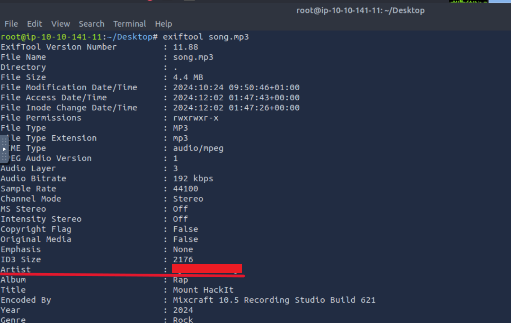
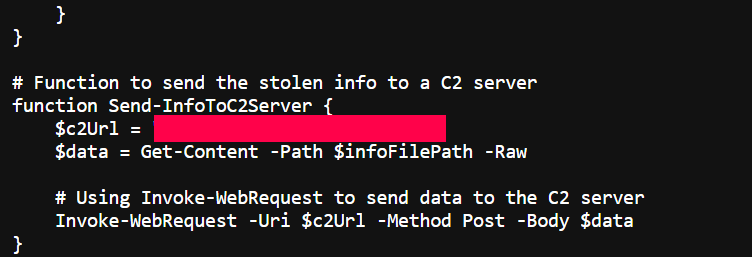
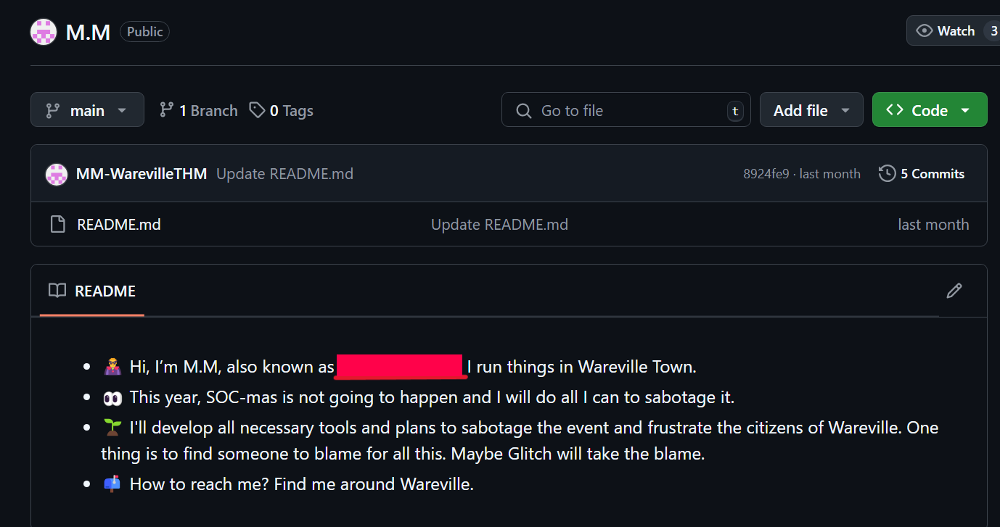
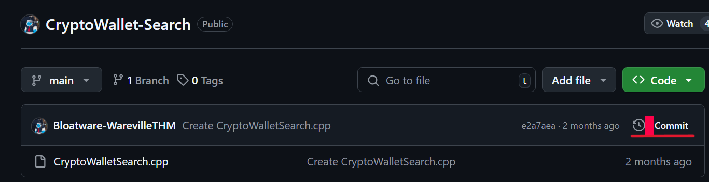

# Advent of Cyber 2024 Writeup: Day 1

## Overview
**Room URL:** https://tryhackme.com/r/room/adventofcyber2024 \
**Difficulty:** Easy\
**Category:** OPSec\
**Date Completed:** 12/02/2024

### Objectives
1. Learn how to investigate malicious link files.
2. Learn about OPSec and OPSec failures.
3. Understand how to track and attribute digital identities in cyber investigation. 

---

## Table of Contents
1. [Introduction](#introduction)   
2. [Walkthrough](#walkthrough)  
   - [Task 7: Maybe SOC-mas music, he thought, doesn't come from a store?](#task-7-maybe-soc-mas-music-he-thought-doesnt-come-from-a-store)
3. [Lessons Learned](#lessons-learned)  
4. [References](#references)

---

## Introduction
This room is the first challenge in Advent of Cyber 2024. It is a basic room that gives information about Advent of Cyber and a task related to Operational Security or OPSec. It aims to teach about the investigation of malicious shortcut or link files in Windows as well as gives a practical approach to uncovering digital identities in a cyber investigation. It covers using the `file` command and the `exiftool` command to investigate files in a system. It also has a basic powershell script to examine.

---

## Walkthrough
Since the tasks 1 to 6 are rudimentary, I'll only talk about Task 7.
### Task 7: Maybe SOC-mas music, he thought, doesn't come from a store?

#### Sub-Question 1: Looks like the song.mp3 file is not what we expected! Run "exiftool song.mp3" in your terminal to find out the author of the song. Who is the author? 
- **Steps Taken:**
    - **Command Action:**
        ```bash
        exiftool song.mp3
        ```
    - **Explanation:** This command provides us with information about the metadata of `song.mp3`. One such metadata is `Artist`.
- **Output/Result:** 

#### Sub-Question 2: The malicious PowerShell script sends stolen info to a C2 server. What is the URL of this C2 server?
- **Steps Taken:** Looking at the malicious script provided by `somg.mp3`, if we go to the `Send-InfoToC2Server` function, we can see the URL of the Command and Control server.

- **Output/Result:** \
    

#### Sub-Question 3: Who is M.M? Maybe his Github profile page would provide clues?
- **Steps Taken:** From the `Issues` page, if we go to the profile of `M.M`, we can find the config files for this profile's Github page where we can find the answer.
- **Output/Result:** 

#### Sub-Question 4: What is the number of commits on the GitHub repo where the issue was raised?
- **Steps Taken:** From the `Issues` page, go to the `Code` page and the number of commits is in plain sight.
- **Output/Result:** 

---

## Lessons Learned
- Learned about Operational Security (OPSec) failures,  and real world examples of when hackers failed to protect their digital identities.
- Learned about the usage of `file` and `exiftool` for investigating `.lnk` files.
- Learned about following clues to discover digital identities in cybersecurity investigations.

---

## References
1. [file](https://linux.die.net/man/1/file)
2. [exiftool](https://linux.die.net/man/1/exiftool) 