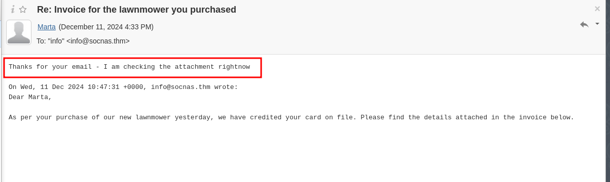
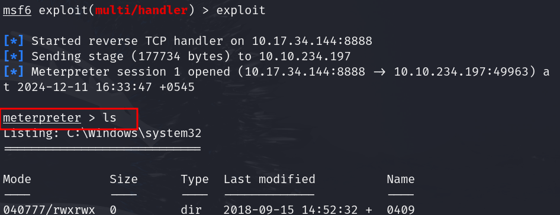
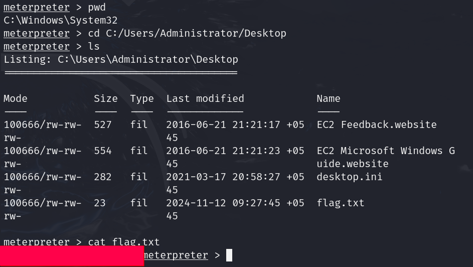

# Advent of Cyber 2024 Writeup: Day 10

## Overview
**Room URL:** https://tryhackme.com/r/room/adventofcyber2024 \
**Difficulty:** Easy\
**Category:** Phishing\
**Date Completed:** 12/11/2024

### Objectives
1. Understand how phishing attacks work.
2. Discover how macros in documents can be used and abused.
3. Learn how to carry out a phishing attack with a macro.
---

## Table of Contents
1. [Introduction](#introduction)  
2. [Walkthrough](#walkthrough)  
   - [Task 16: He had a brain full of macros, and had shells in his soul.](#task-16-he-had-a-brain-full-of-macros-and-had-shells-in-his-soul)  
3. [Lessons Learned](#lessons-learned)  
4. [References](#references)

---

## Introduction
This task focuses on leveraging phishing to get reverse shell into the victim's machine. In this task, we'll use the widely popular `macro` feature of Microsoft Office to exploit the machine. `Macro` feature is intended to automate repetitive tasks but it can leveraged as a point of vulnerability to infect gullible victims.

---

## Walkthrough

### Task 16: He had a brain full of macros, and had shells in his soul.

#### Sub-Question: What is the flag value inside the `flag.txt` file that’s located on the Administrator’s desktop?

  - **Steps Taken:** We first use metasploit to craft a malicious macro payload that is saved as `msf.docm`. We again use metasploit to listen for incoming reverse shell connections. The malicious macro is renamed to `invoice.docm` to make it sound convincing. After that I wrote a few lines tempting the user to download the malicious attachment. I sent this file and got a reply back in a few minutes.
      
  I checked the listening terminal and I saw that reverse shell was working. This shows that the victim downloaded the file and opened it.
        
  I checked the current directory with `pwd` and moved to the Administrator's desktop with `cd` command. Then I listed the content of `flag.txt` with the `cat` command.
        

---

## Lessons Learned
- Learned how to use Metasploit or `msfconsole` to generate a macro for gaining reverse shell into the target's machine and also to setup a listener that listens for connection requests from the compromised machine.

- Learned how to traverse the victim's machine using the `meterpreter` shell.

- Learned the importance of organization wide phishing exercises and awareness training.

---

## References

