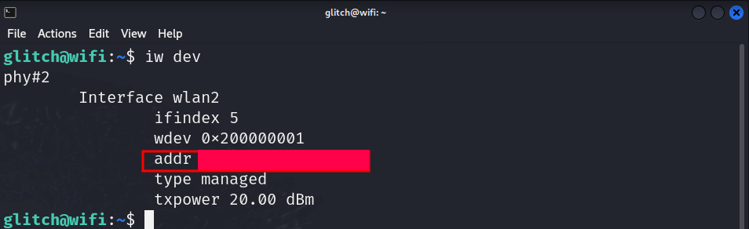
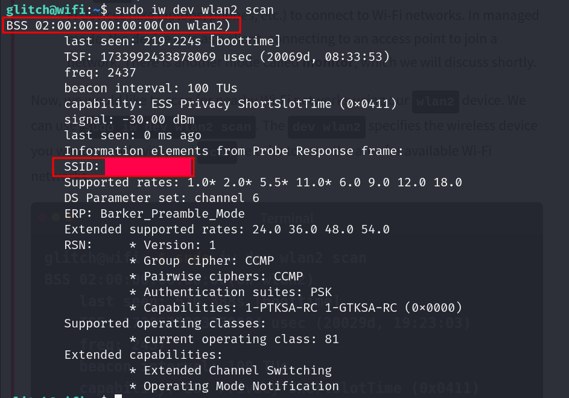
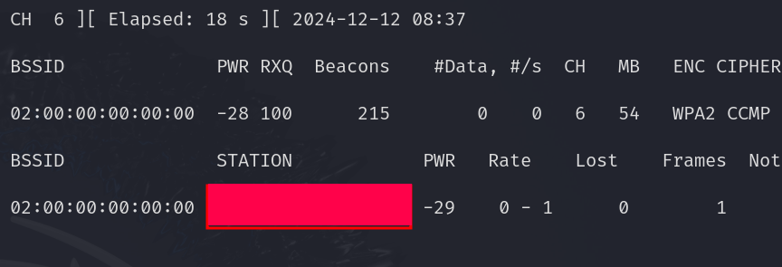
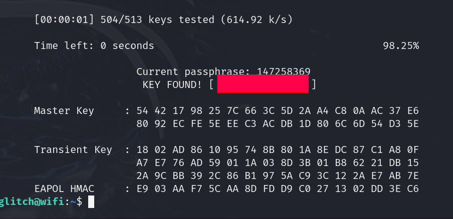

# Advent of Cyber 2024 Writeup: Day 11

## Overview
**Room URL:** https://tryhackme.com/r/room/adventofcyber2024 \
**Difficulty:** Easy\
**Category:** Wi-fi Attacks\
**Date Completed:** 12/12/2024

### Objectives
1. Understand what Wi-Fi is.
2. Explore its importance for an organization
3. Learn the different Wi-Fi attacks.
4. Learn about the WPA/WPA2 cracking attack.

---

## Table of Contents
1. [Introduction](#introduction)  
2. [Walkthrough](#walkthrough)  
   - [Task 17: If you'd like to WPA, press the star key!](#task-17-if-youd-like-to-WPA-press-the-star-key)  
3. [Lessons Learned](#lessons-learned)  
4. [References](#references)

---

## Introduction
This task focuses on the widespread use of Wi-Fi in the modern age and how the convinience it provides can be leveraged to increase security risk of an organization. It talks about the various types of attacks on Wi-Fi and how capturing a **4-way TCP handshake** between a host and an access point can enable malicious actors to use offline brute force technique with wordlists to find the PSK or password of the Wi-Fi network. 

---

## Walkthrough

### Task 17: If you'd like to WPA, press the star key!

#### Sub-Question: What is the BSSID of our wireless interface?
  - **Steps Taken:** The `BSSID` of our wireless interface `wlan2` can be found simply by running the command `iw dev`
  - **Output/Result:**  
        

#### Sub-Question: What is the SSID and BSSID of the access point? Format: SSID, BSSID
  - **Steps Taken:** The `SSID` and `BSSID` of the access point can be found by scanning nearby the device. However, we have to set the interface type to `monitor`. After that we can simply run the command `sudo iw dev wlan2 scan` to get the answer.
  - **Output/Result:**  
        

#### Sub-Question: What is the BSSID of the wireless interface that is already connected to the access point?
  - **Steps Taken:** This answer can be found by running `airodump-ng` with the command `sudo airodump-ng -c <Channel> --bssid <BSSID of access point> -w output-file wlan2`. After a while, we see a device is connected to the access point under the `STATION` heading.
  - **Output/Result:**  
        

#### Sub-Question: What is the PSK after performing the WPA cracking attack?
  - **Steps Taken:** To find this, we have to complete the entire task. First we set our interface to `monitor` mode. Then we use `airodump-ng` to capture packets for the access point. Side by side we use `aireplay-ng` to deauthenticate the connected device forcing it to initiate the 4-way handshake in order to reconnect to the access point. After that we have successfully captured the 4 way TCP handshake and we can use `aircrack-ng` with a suitable wordlist to crack the password using the command `sudo aircrack-ng -a 2 -b <BSSID of access point> -w <Wordlist> <Captured PCAP file(s)>`
  - **Output/Result:**  
        

---

## Lessons Learned
- Learned how to crack WPA/WPA2 Wi-fi password using `airodump-ng`, `aireplay-ng` and `aircrack-ng`.

- Learned that WPA2 contains `Robust Security Network (RSN)` field and `CCMP` as Group and Pairwise Ciphers.

---

## References
