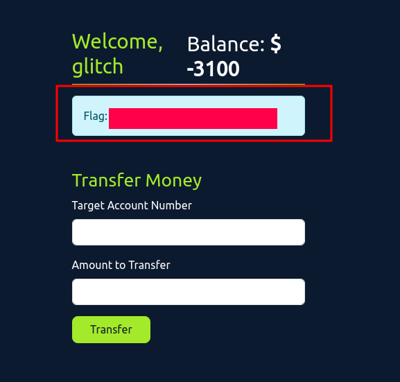

# Advent of Cyber 2024 Writeup: Day 12

## Overview
**Room URL:** https://tryhackme.com/r/room/adventofcyber2024 \
**Difficulty:** Easy\
**Category:** Web timing attacks\
**Date Completed:** 12/13/2024

### Objectives
1. Understand the concept of race condition vulnerabilities.
2. Identify the gaps introduced by HTTP/2
3. Exploit race conditions in a controlled environment.
4. Learn how to fix the race condition.

---

## Table of Contents
1. [Introduction](#introduction)  
2. [Walkthrough](#walkthrough)  
   - [Task 18: If I can’t steal their money, I’ll steal their joy!](#task-18-if-i-cant-steal-their-money-ill-steal-their-joy)  
3. [Lessons Learned](#lessons-learned)  
4. [References](#references)

---

## Introduction
This task focuses on using race conditions to conduct web timing attacks. **Web timing attacks** are when we use the processing time of a request to learn some information from a web application that we are not authorized to learn. **Race conditions** are a special case of web timing attacks where requests access shared variables without proper locks causing the application to deliver unexpected results. As an example, we can think of the same discount coupon being applied twice when used simultaneously or an account being able to withdraw more than its current balance through carefully crafted simultaneous requests.

*Race Conditions enable simultaneous transactions to take place that would fail if these transactions were processed sequentially.*

---

## Walkthrough

### Task 18: If I can’t steal their money, I’ll steal their joy!

#### Sub-Question: What is the flag value after transferring over $2000 from Glitch's account?

  - **Steps Taken:** I used `Burp` to intercept the packets being sent from the application to the server. As guided, there's a `POST` request to `/transfer` that gets sent to the server when money is transferred to another account. This request contains parameters `account_number` and `amount`. Using burp's `Repeater`, I created multiple tabs of the `POST` request and created a new group for them. After that, I sent the repeated request as a group by selecting `Send group in parallel (last-byte sync)` option. After reloading, I saw the balance was negative and the flag right there.
  - **Output/Result:**  
        

---

## Lessons Learned
- Understood how the adoption of `HTTP/2` is helping make web timing attacks more effective. `HTTP/2` uses a mechanism where multiple requests are sent in a single-packet. This makes it easy to detect timing issues and exploit them.

- Race conditions can be overcome as follows:
    - **Atomic database transactions** where updates are performed as an indivisible unit
    - **Implementing mutex locks** so that only one thread can acces the shared resource at a time
    - **Applying rate limits** so that rapid requests to a shared resource is restricted.

---

## References
