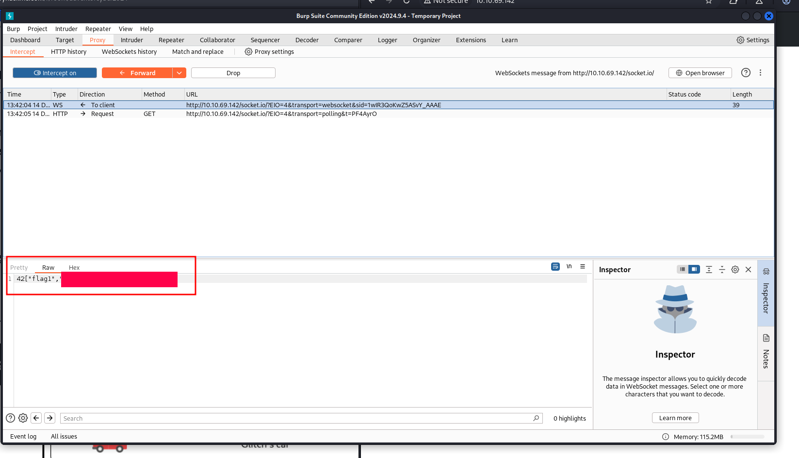
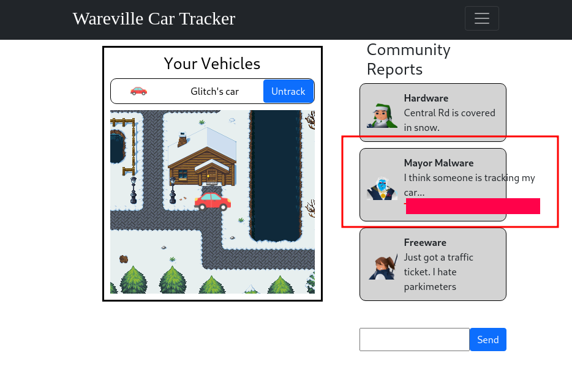
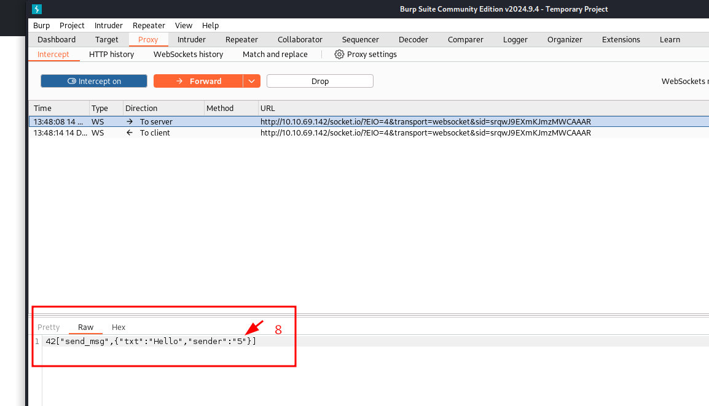
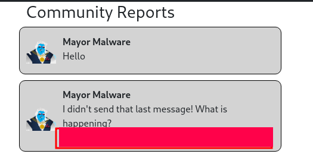

# Advent of Cyber 2024 Writeup: Day 13

## Overview
**Room URL:** https://tryhackme.com/r/room/adventofcyber2024 \
**Difficulty:** Easy\
**Category:** Websockets\
**Date Completed:** 12/14/2024

### Objectives
1. Learn about Websockets and their vulnerabilities.
2. Learn how WebSocket Message Manipulation can be done.

---

## Table of Contents
1. [Introduction](#introduction)  
2. [Walkthrough](#walkthrough)  
   - [Task 13: It came without buffering! It came without lag!](#task-13-it-came-without-buffering-it-came-without-lag)  
3. [Lessons Learned](#lessons-learned)  
4. [References](#references)

---

## Introduction
This task talks about websockets and their importance in real time communication. Websockets are a way to keep a constant communication line open between a client and a server. This is different from traditional `HTTP` as `HTTP` requires connection to be established for every new request or data required by the client. However, using websockets can increase the vulnerability of the system due to its weak authentication and authorization and increased risk of message tampering. 

---

## Walkthrough

### Task 13: It came without buffering! It came without lag!

#### Sub-Question: What is the value of Flag1?

  - **Steps Taken:** To find the value of `Flag1`, I simply intercepted the `track` request using `Burp` and changed the `userId` parameter from `5` to `8`. After a few messages, I see the answer in both the proxy tab and the website.
      
              

#### Sub-Question: What is the value of Flag2?

  - **Steps Taken:** To find the value of `Flag2` I simply wrote a `Hello` message in th website, intercepted it and changed the `sender` parameter to `8`. After a short while, the flag was displayed in the website.
      
         

---

## Lessons Learned
- Learned about the vulnerabilities of websockets to man-in-the-middle attacks and understood the importance of securing it with `SSL` and using strong authentication. 

---

## References
