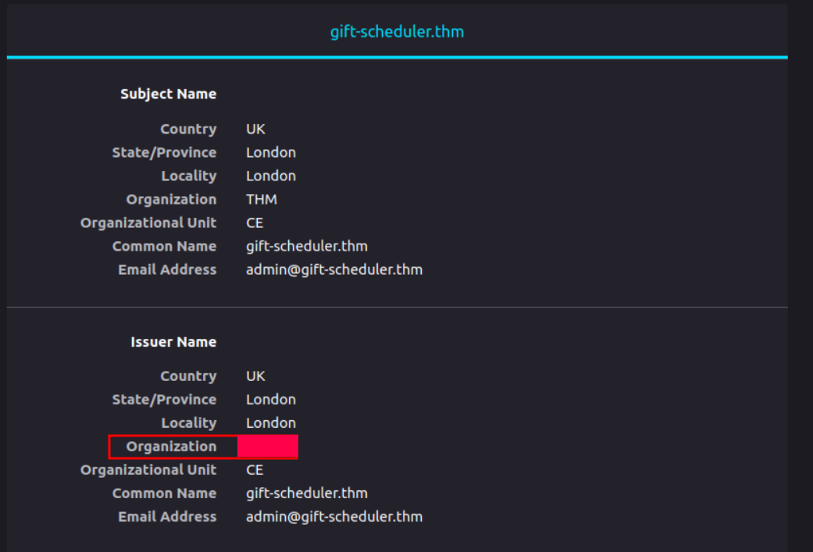
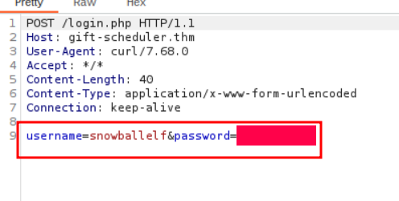
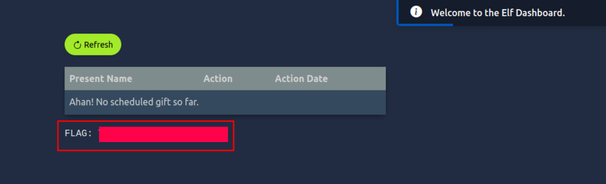
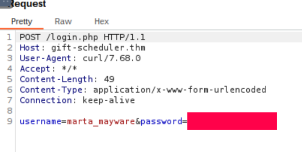
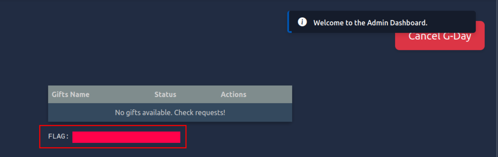

# Advent of Cyber 2024 Writeup: Day 14

## Overview
**Room URL:** https://tryhackme.com/r/room/adventofcyber2024 \
**Difficulty:** Easy\
**Category:** Certificate Mismanagement\
**Date Completed:** 12/15/2024

### Objectives
1. Learn about self-signed certificates.
2. Learn about man-in-the-middle attacks.
3. Learn about using `Burp Suite Proxy` to intercept traffic.

---

## Table of Contents
1. [Introduction](#introduction)  
2. [Walkthrough](#walkthrough)  
   - [Task 20: Even if we're horribly mismanaged, there'll be no sad faces on SOC-mas!](#task-20-even-if-were-horribly-mismanaged-therell-be-no-sad-faces-on-soc-mas)  
3. [Lessons Learned](#lessons-learned)  
4. [References](#references)

---

## Introduction
This task focuses on how mismanaged certificates can pose a serious risk to a system. A `certificate` is a digital file consisting of a public key and metadata that verifies the identity of a website and enables an encrypted connection. A certificate is typically issued by a `Certificate Authority (CA)` but this process can be tedious. Hence, usually for things like development environment, self-signed certificates are used. `Self-signed certificates` are digital certificates that is signed by the same entity that it certifies. They are not trusted by web browsers and should not be used in public-facing websites.

---

## Walkthrough

### Task 20: Even if we're horribly mismanaged, there'll be no sad faces on SOC-mas!

#### Sub-Question: What is the name of the CA that has signed the Gift Scheduler certificate?

  - **Steps Taken:** When we first go to `gift-scheduler.thm`, we see the option to view the certificate. Here, under the issuer tab is the required answer. 
  - **Output/Result:**  
        

#### Sub-Question: Look inside the POST requests in the HTTP history. What is the password for the snowballelf account?

  - **Steps Taken:** After burp suite has been configured as a listening proxy, we can see a bunch of `POST` requests in the `HTTP history` tab. Here we can look through some of them to find the appropriate request containing the credential we need.
  - **Output/Result:**  
        

#### Sub-Question: Use the credentials for any of the elves to authenticate to the Gift Scheduler website. What is the flag shown on the elves’ scheduling page?

  - **Steps Taken:** After logging in to the website using `snowballelf`'s credentials, we are greeted with a flag.
  - **Output/Result:**  
        

#### Sub-Question: What is the password for Marta May Ware’s account?

  - **Steps Taken:** After burp suite has been configured as a listening proxy, we can see a bunch of `POST` requests in the `HTTP history` tab. Here we can look through some of them to find the appropriate request containing the credential we need.
  - **Output/Result:**  
        

#### Sub-Question: What is the flag shown on the admin page?

  - **Steps Taken:** After logging in to the website using `marta_mayware`'s credentials, we are greeted with a flag.
  - **Output/Result:**  
        

---

## Lessons Learned
- Learned how to setup a proxy listener exploiting the self-signed certificates and conducting a `Man-in-the-middle` attack.

- Learned that locally resolving a website is a way to cover tracks and prevent DNS log alerts.

---

## References