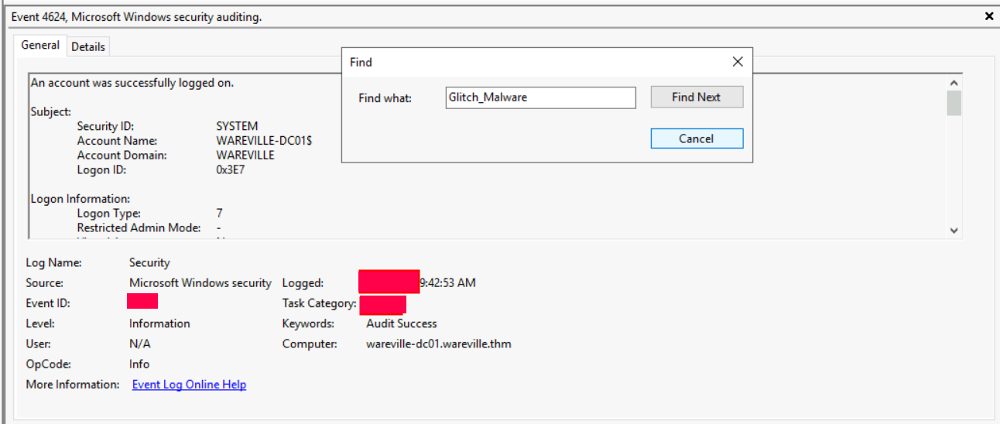
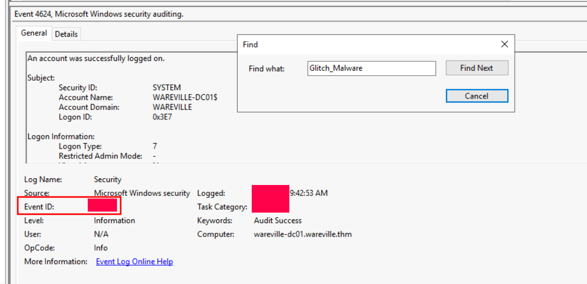
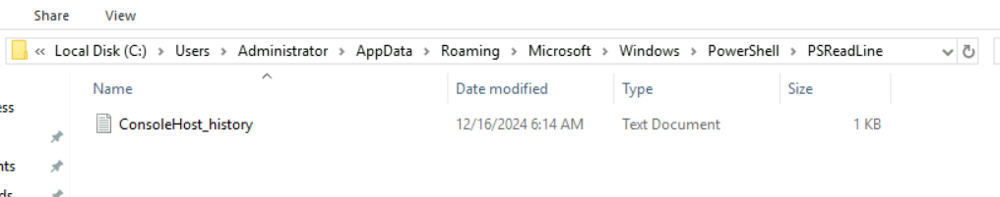
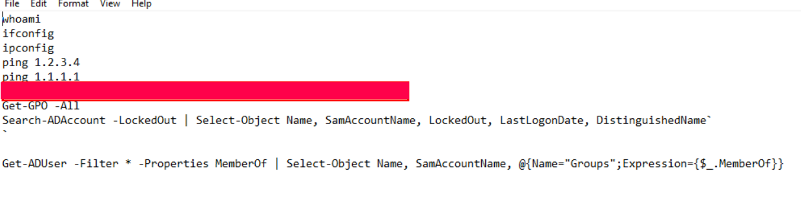
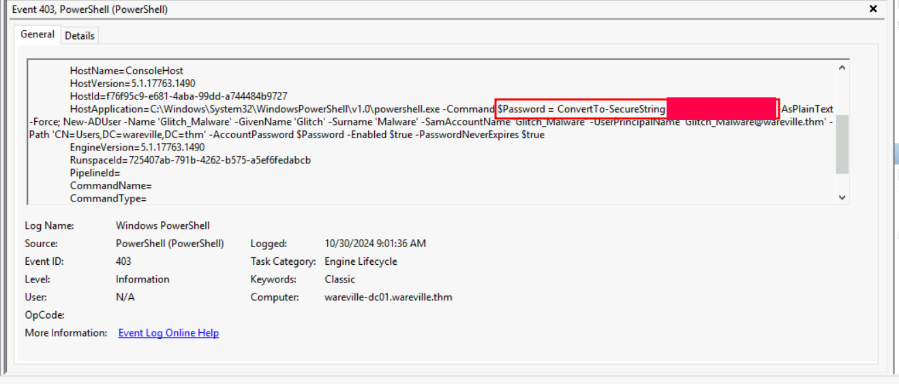
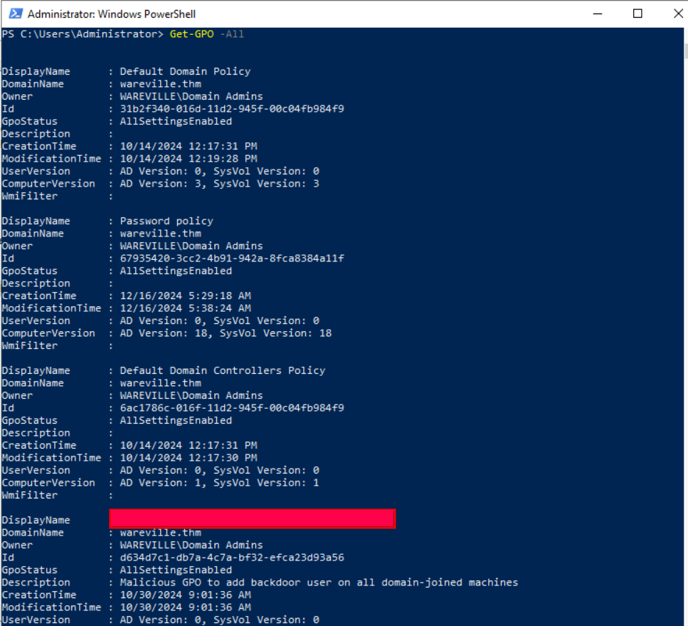

# Advent of Cyber 2024 Writeup: Day 15

## Overview
**Room URL:** https://tryhackme.com/r/room/adventofcyber2024 \
**Difficulty:** Easy\
**Category:** Active Directory\
**Date Completed:** 12/16/2024

### Objectives
1. Learn about the structures of Active Directory.
2. Learn about common Active Directory Attacks.
3. Investigate a breach against an Active Directory.

---

## Table of Contents
1. [Introduction](#introduction)  
2. [Walkthrough](#walkthrough)  
   - [Task 21: Be it ever so heinous, there's no place like Domain Controller.](#task-21-be-it-ever-so-heinous-theres-no-place-like-domain-controller)  
3. [Lessons Learned](#lessons-learned)  
4. [References](#references)

---

## Introduction
This task focuses on `Active Directory`, ways it can be attacked and how breaches can be detected in it. It also walks us through creating and enforcing a password policy using the `Group Policy Management Console`. We learn that AD is simply a service for mapping networked infrastructure and provide access to network resources within an organization. It does this by using `LDAP` which is a protocol used to query and modify the directory. 

The heart of an Active Directory is a `Domain Controller`. Domain Controllers are the servers that host AD Services, store the AD database and handle authentication and authorization requests such as logging in users and verifying access to resources.

---

## Walkthrough

### Task 21: Be it ever so heinous, there's no place like Domain Controller.

#### Sub-Question: On what day was Glitch_Malware last logged in?
  - **Steps Taken:** On `Event Viewer` I used the `Find` feature to look for any mention of `Glitch_Malware`. After going through some Log-off events, I finally found the required event with the timestamp. (P.s: Check for `DD/MM` and `MM/DD` both)
  - **Output/Result:**  
        
  - **Answer:** `07/11/2024`

#### Sub-Question: What event ID shows the login of the Glitch_Malware user?
  - **Steps Taken:** Same as above, the `event ID` is in plain sight in the above step.
  - **Output/Result:**  
        
  - **Answer:** `4624`

#### Sub-Question: Read the PowerShell history of the Administrator account. What was the command that was used to enumerate Active Directory users?
  - **Steps Taken:** I went to the path as described by the walkthrough part. There was a difference though. I had to go through `%APPDATA%/Roaming/Microsoft...` instead of just `%APPDATA%/Microsoft...`. There was two commands logged that could be used for enumerating users but I guess the question is looking for the shorter one.
  - **Output/Result:**  
      
        
  - **Answer:** `Get-ADUser -Filter * -Properties MemberOf | Select-Object Name`

#### Sub-Question: Look in the PowerShell log file located in `Application and Services Logs -> Windows PowerShell`. What was Glitch_Malware's set password?
  - **Steps Taken:** I used the `Find` feature for `Glitch_Malware` and saw a powershell command being used to set the password for the account.
  - **Output/Result:**  
        
  - **Answer:** `SuperSecretP@ssw0rd!`

#### Sub-Question: Review the Group Policy Objects present on the machine. What is the name of the installed GPO?
  - **Steps Taken:** I used the `Get-GPO -All` command in powershell and browsed through suspicious logs to find the answer.
  - **Output/Result:**  
        
  - **Answer:** `Malicious GPO - Glitch_Malware Persistence`

---

## Lessons Learned

- `Powershell` Logs are stored at `%APPDATA%\Roaming\Microsoft\Windows\Powershell\PSReadLine\ConsoleHost_history.txt` and can be viewed in the `Event Viewer` under `Application and  Services Logs -> Windows Powershell`.

- The following `Event IDs` are of interest when auditing Active Directory:
    - `4624` - A user account has logged on.
    - `4625` - A user account failed to log on.
    - `4672` - Special Privileges was assigned to user.
    - `4678` - A TGT ticket was request for a high-privileged account.

---

## References
