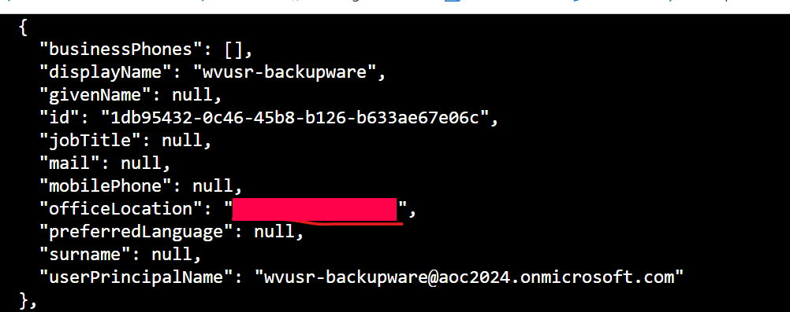
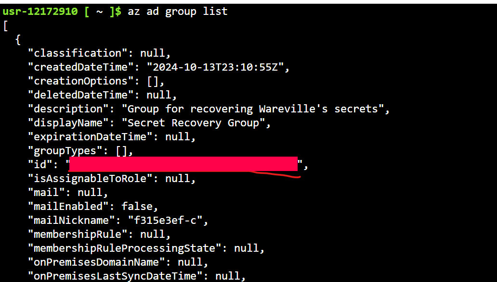
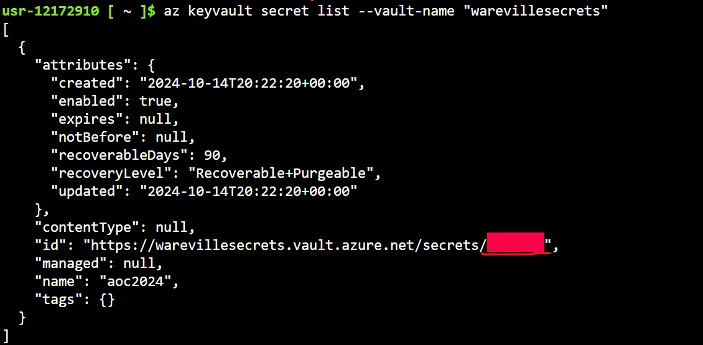

# Advent of Cyber 2024 Writeup: Day 16

## Overview
**Room URL:** https://tryhackme.com/r/room/adventofcyber2024 \
**Difficulty:** Easy\
**Category:** Azure\
**Date Completed:** 12/16/2024

### Objectives
1. Learn about Azure, what it is and why it is used.
2. Learn about Azure services like Azure Key Vault and Microsoft Entra ID.
3. Learn how to interact with an Azure tenant using Azure Cloud Shell.

---

## Table of Contents
1. [Introduction](#introduction)  
2. [Walkthrough](#walkthrough)  
   - [Task 22: The Wareville’s Key Vault grew three sizes that day.](#task-22-the-warevilles-key-vault-grew-three-sizes-that-day)  
3. [Lessons Learned](#lessons-learned)  
4. [References](#references)

---

## Introduction
This task focuses on `Azure` and how it can be exploited to extract `Secrets` such as Passwords, keys and certificates simply due to improper audit of user privileges and not following the principle of least privilege.

---

## Walkthrough

### Task 22: The Wareville’s Key Vault grew three sizes that day.

#### Sub-Question: What is the password for backupware that was leaked?
  - **Steps Taken:** I used the command `az ad user list --filter "startsWith('wvusr-', displayName)"`. Browsing the response for the `backupware` account, the password was exposed in the `officeLocaton` field.
  - **Output/Result:**  
        
  - **Answer:** `R3c0v3r_s3cr3ts!`

#### Sub-Question: What is the group ID of the Secret Recovery Group?
  - **Steps Taken:** I used the command `az ad group list`. The `id` field in the response is the answer.
  - **Output/Result:**  
        
  - **Answer:** `7d96660a-02e1-4112-9515-1762d0cb66b7`

#### Sub-Question: What is the name of the vault secret?
  - **Steps Taken:** I used the command `az keyvault secret list --vault-name warevillesecrets`. The response contains the answer in the `name` field.
  - **Output/Result:**  
        
  - **Answer:** `aoc2024`

#### Sub-Question: What are the contents of the secret stored in the vault?
  - **Steps Taken:** I used the command `az keyvault secret show --vault-name warevillesecrets --name aoc2024`. The `vaule` field contains the answer.
  - **Output/Result:**  
        
  - **Answer:** `WhereIsMyMind1999`
---

## Lessons Learned

- Learned about `Microsoft Azure` and its Identity and Management service `Microsoft Entra ID` that is tasked with the responsibility of identifying whether a user/application is allowed access to a certain resource based on pre-defined rules.

- Learned key `AWS CLI` bash commands for enumerating users and groups.

- Learned commands for checking members of a group, checking role assignments for users and showing secrets if appropriate roles are assigned to the user.

---

## References
