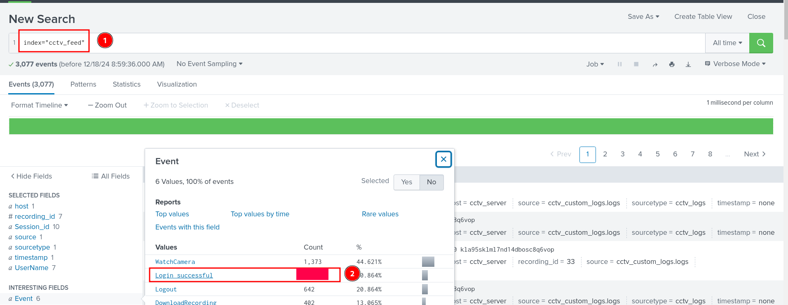
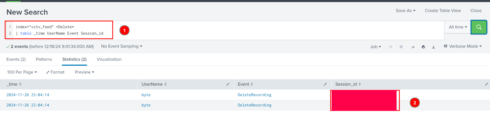
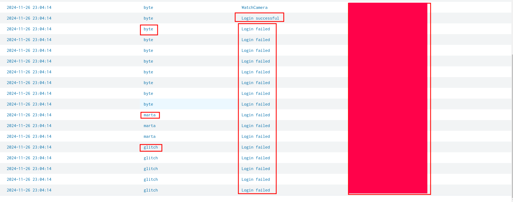
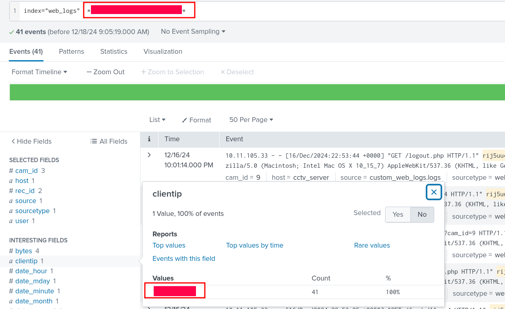
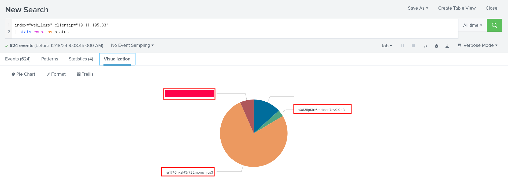
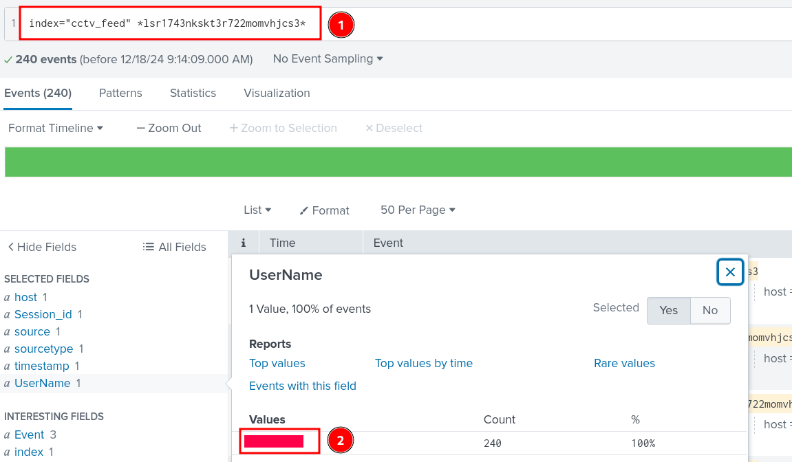

# Advent of Cyber 2024 Writeup: Day 17

## Overview
**Room URL:** https://tryhackme.com/r/room/adventofcyber2024 \
**Difficulty:** Easy\
**Category:** Log Analysis\
**Date Completed:** 12/18/2024

### Objectives
1. Learn how to extract custom fields in Splunk
2. Learn to create a parser for the custom logs
3. Filter and narrow down the search results using Search Processing Language (SPL)
4. How to investigate in Splunk

---

## Table of Contents
1. [Introduction](#introduction)  
2. [Walkthrough](#walkthrough)  
   - [Task 23: He analyzed and analyzed till his analyzer was sore!](#task-23-he-analyzed-and-analyzed-till-his-analyzer-was-sore)  
3. [Lessons Learned](#lessons-learned)  
4. [References](#references)

---

## Introduction
This task focuses on using `Splunk`, a very popular SIEM platform to investigate logs out of CCTV and web logs to find out who deleted the recording. In the process, we'll learn about extracting fields from logs using `regex` and validate this with the entries in the SIEM. We'll also learn basic commands and understand how to navigate the Splunk environment.

---

## Walkthrough

### Task 23: He analyzed and analyzed till his analyzer was sore!

#### Sub-Question: Extract all the events from the cctv_feed logs. How many logs were captured associated with the successful login?

  - **Steps Taken:** I basically searched for all the logs in the `cctv_feed` source and used the left tab to find out the number of `Login successfull` events.
  - **Output/Result:**  
        

#### Sub-Question: What is the Session_id associated with the attacker who deleted the recording?
  - **Steps Taken:** I searched for the events in the `cctv_feed` associated to `Delete` and presented them in a tabular form with `Timestamp`, `Username`, `Event` and `Session_id`. All the relevant events had the same `Session_id`. 
  - **Output/Result:**  
        

#### Sub-Question: What is the name of the attacker found in the logs, who deleted the CCTV footage?
  - **Steps Taken:** Investigating the `Session_id` obtained from the previous step, I found out that the same ID has been used for multiple users and shows indication of a brute force attack with multiple `Login Failed` events with finally one `Login Successful` events. This session ID is clearly suspicious.
    

    I then investigated the `web_logs` source for the same session_id and found out that all of the entries with this session ID share a common `clientIP` address. This IP address is clearly suspcious.
    

    I searched for this IP address to see whether or not it has other `session_id` (`status` in case of `web_logs`) associated with it and it does have two more of them.
    
   
    I investigated the `session_id` with the most count in the `cctv_feed` source and found out that all of them were associated with a single user.
    

---

## Lessons Learned
- Learned how to extract custom fields in Splunk through `Regex`.

- Learned how to investigate logs from multiple sources and correlate IOCs to one another in order to find crucial evidence and attribute events to the actual malicious actor.

---

## References
