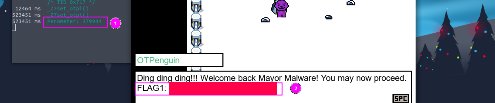
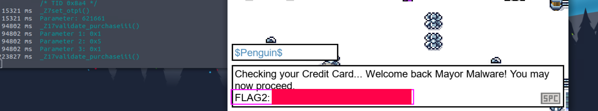
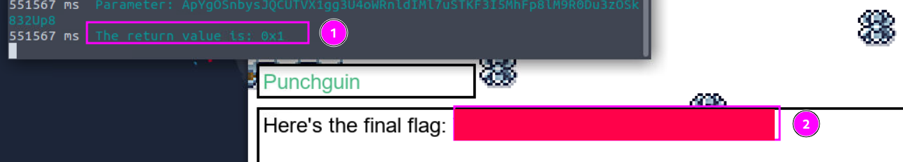

# Advent of Cyber 2024 Writeup: Day 19

## Overview
**Room URL:** https://tryhackme.com/r/room/adventofcyber2024 \
**Difficulty:** Easy\
**Category:** Game Hacking\
**Date Completed:** 12/20/2024

### Objectives
1. Understand how to interact with an executable's API.
2. Intercept and modify internal APIs using Frida.
3. Hack a game with the help of Frida.

---

## Table of Contents
1. [Introduction](#introduction)  
2. [Walkthrough](#walkthrough)  
   - [Task 25: I merely noticed that you’re improperly stored, my dear secret!](#task-25-i-merely-noticed-that-youre-improperly-stored-my-dear-secret)  
3. [Lessons Learned](#lessons-learned)  
4. [References](#references)

---

## Introduction
This task was really fun and introduced me to the world of game hacking. From the task description, It is stated that game hacking is a very small percentage of the larger cybersecurity field. However, due to the massive reach and stakes involved, it is important to understand how games can be hacked. 

A game typically consists of an executable and external library files which contains functions used by the executables to run properly. The executable calls the appropriate functions  in the library files with certain input and uses the output it gets to conduct the tasks in-game to ensure a smooth experience. `Frida` places itself in the middle of this communication and intercepts it. This allows it to change the inputs and outputs or read them, whichever is required.

---

## Walkthrough

### Task 25: I merely noticed that you’re improperly stored, my dear secret!

#### Sub-Question: What is the OTP flag?
  - **Steps Taken:** I simply followed the instructions in the task description and logged the `OTP` parameter using `Frida`. This gave the `OTP` in the console and flag in-game. 
  - **Output/Result:**  
        

#### Sub-Question: What is the billionaire item flag?
  - **Steps Taken:** I simply followed the instructions in the task description and set the Item's Price to be 0. From inspection, it was found that `args[1]` is the pointer to the item's price. So I set `args[1] = ptr(0)` in the `onEnter` hook.
  - **Output/Result:**  
        
    
#### Sub-Question: What is the billionaire item flag?
  - **Steps Taken:** I again followed the instructions in the task description and set the Boolean value returned to be `1` or `True` by using `retval.replace(ptr(1))` in the `onLeave` hook.
  - **Output/Result:**  
        

---

## Lessons Learned
- We run `Frida` by using the `frida-trace` command which creates a `__handlers__` directory containing `Javascript` files for each function call that can be easily modified to influence the game in unintended ways.

- These `.js` files contain two `hooks` (`onEnter` and `onLeave`) that indicates the state of the game.

- `onEnter` contains the `args` variable which points to the inputs to be used by the library function

- `onLeave` contains the `retVal` variable which points to the output returned by the library function.

---

## References
