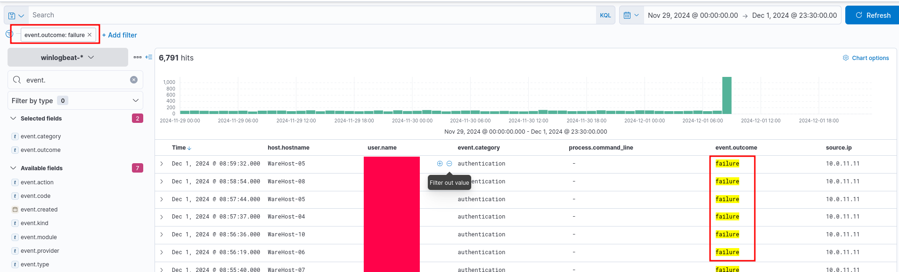
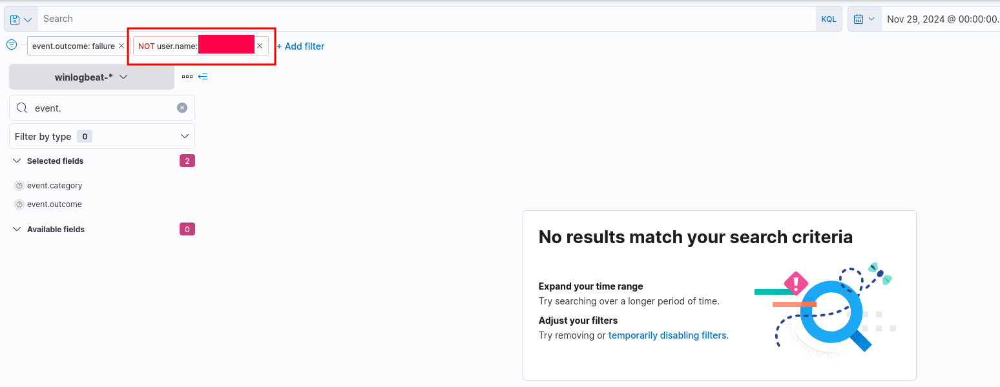
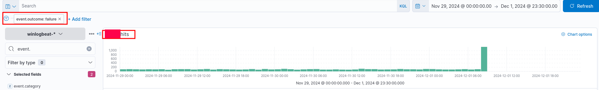
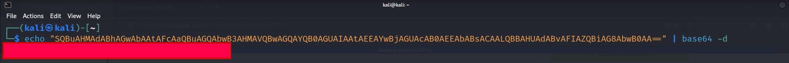

# Advent of Cyber 2024 Writeup: Day 2

## Overview
**Room URL:** https://tryhackme.com/r/room/adventofcyber2024 \
**Difficulty:** Easy\
**Category:** Log Analysis\
**Date Completed:** 12/03/2024

### Objectives
1. Learn about true and false positives in the context of a SOC.
2. Use Elastic SIEM to investigate logs.
3. Learn how to decode Base64 encoded strings.

---

## Table of Contents
1. [Introduction](#introduction)  
2. [Walkthrough](#walkthrough)  
   - [Task 8: One man's false positive is another man's potpourri.](#task-8-one-mans-false-positive-is-another-mans-potpourri)  
3. [Lessons Learned](#lessons-learned)  
4. [References](#references)

---

## Introduction
This task guides us through performing log analysis on logs aggregated using a SIEM, namely Elastic SIEM. Here we analyze logs by filtering the appropriate field names in order to streamline our search for malicious activities. This room is crucial to hone a SOC Analyst's skill to establish and validate hypotheses that come up in the process of analyzing alerts. Furthermore it is necessary to understand that not all alerts are indications of actual malicious activity but may also be failures and inadequacies of detection rules written to flag malicious activity.

---

## Walkthrough

### Task 8: One man's false positive is another man's potpourri.

#### Sub-Question 1: What is the name of the account causing all the failed login attempts?
  - **Steps Taken:** Looking at the logs we can filter the events by setting `event.outcome=failure` and `event.category=authenticate`. Through a cursory glance, seems like all of them appear to originate from a single user.
  - **Output/Result:**  
      
        

#### Sub-Question 2: How many failed logon attempts were observed?
  - **Steps Taken:** Filtering for `event.outcome=failure` and `event.category=authenticate`, we easily find the answer as the number of hits.
  - **Output/Result:**  
        

#### Sub-Question 3: What is the IP address of Glitch?
  - **Steps Taken:** This is the point I had some trouble understanding because I glossed over the explanation...(Sorry!). There are two IP addresses involved in this question: `10.0.11.11` and `10.0.255.1`. When analyzing the logs, we see that one IP address is actually an out of date script that has been detected to attempting failed logins well before December. The question states that the analysts fixed the scipt by providing fresh new credentials so it authenticates properly now. The other IP address however is not a script. During our investigation, we see that it performs a brute force attack, indicated from the spike of events on December 1st, before finally succeeding and gaining access to the `ADM-01` host. This is the required answer.
  - **Output/Result:**  
        

#### Sub-Question 4: When did Glitch successfully logon to ADM-01? Format: MMM D, YYYY HH:MM:SS.SSS

  - **Steps Taken:** From analyzing the logs and looking at the first successful authentication, we have our answer.
  - **Output/Result:**  
      

#### Sub-Question 5: What is the decoded command executed by Glitch to fix the systems of Wareville?
  - **Steps Taken:** We can filter for the `process.command_line` filter and look at the `event.category=process`. All of them seem to be the same encoded powershell command. Also, looking at the payload, we can see that it is in Base64 format because of the `==` at the end. So, we copy that encoded string and use the terminal to find the answer.
  - **Output/Result:**  
        

---

## Lessons Learned
Summarize key takeaways from the room. Examples:
- Learned about Log analysis in the context of brute-force attempts and attacks.
- Learned about the usage of field names to filter logs for clearer investigations.
- Learned about extracting artifacts from logs and making a timeline for events in a security investigation.
---

## References
1. [Elastic SIEM](https://www.elastic.co/guide/en/siem/guide/current/index.html)
