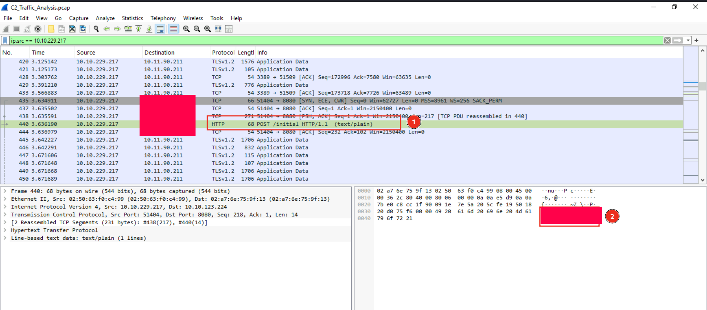
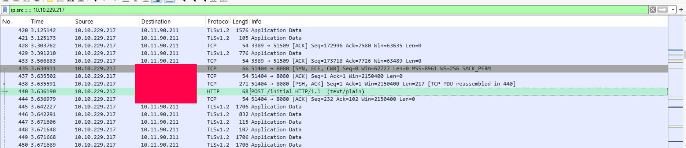
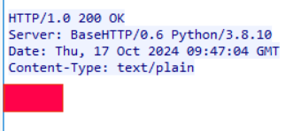
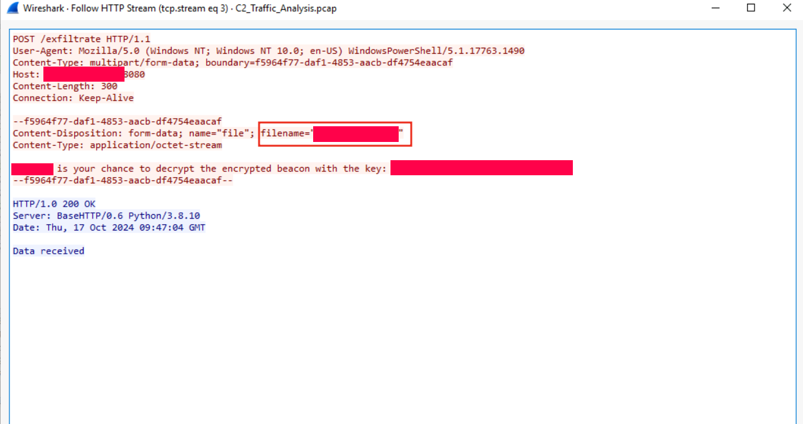
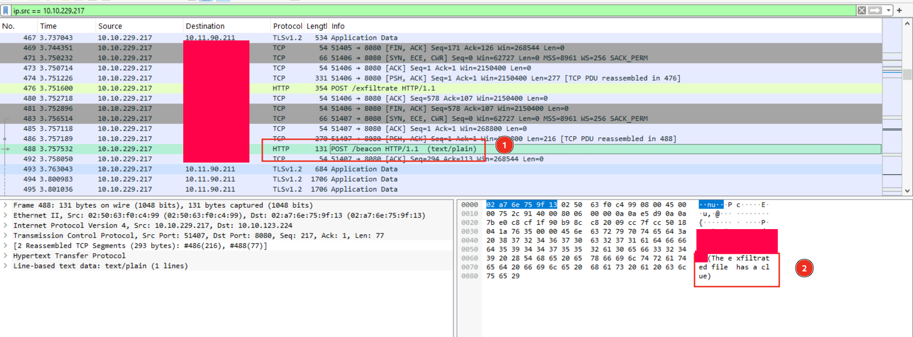
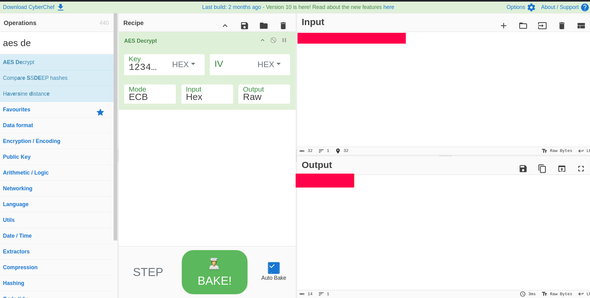

# Advent of Cyber 2024 Writeup: Day 20

## Overview
**Room URL:** https://tryhackme.com/r/room/adventofcyber2024 \
**Difficulty:** Easy\
**Category:** xx\
**Date Completed:** 12/21/2024

### Objectives
1. Investigate network traffic using Wireshark
2. Identify indicators of compromise (IOCs) in captured network traffic
3. Understand how C2 servers operate and communicate with compromised systems

---

## Table of Contents
1. [Introduction](#introduction)  
2. [Walkthrough](#walkthrough)  
   - [Task 26: If you utter so much as one packet…](#task-26-if-you-utter-so-much-as-one-packet)  
3. [Lessons Learned](#lessons-learned)  
4. [References](#references)

---

## Introduction
In this task, we'll analyze and infected machine's network traffic with the help of `Wireshark`. `Wireshark` and its command-line alternative `TCPDump` are tools that are commonly known as `network traffic analyzers`. They are used to analyze network traffic both coming in and coming out of a particular machine along with finding out `Indicators of Compromise (IOC)` such as malicious IP addresses, malicious URLs and strange behavior such as communication with an unknown address.

---

## Walkthrough

### Task 26: If you utter so much as one packet…

#### Sub-Question: What was the first message the payload sent to Mayor Malware’s C2?
  - **Steps Taken:** I filtered the captured traffic to only show the traffic from the infected host using the filter `ip.src == 10.10.229.217`. After going through the result, I found an interesting `POST` request containing the answer.
  - **Output/Result:**  
        

#### Sub-Question: What was the IP address of the C2 server?
  - **Steps Taken:** The first message and further `beacons` and `exfiltration` packets are all sent to the same IP address which is the C2 server's address.  
  - **Output/Result:**  
       

#### Sub-Question: What was the command sent by the C2 server to the target machine?
  - **Steps Taken:** Following the `HTTP stream` between the infected server and the C2 server, we find out the answer.
  - **Output/Result:**  
       

#### Sub-Question: What was the filename of the critical file exfiltrated by the C2 server?
  - **Steps Taken:** I further analyzed the communication between the infected machine and the C2 server. There's a curious `POST` request made on the `/exfiltrate` endpoint. Upon following it's HTTP stream I found the answer along with the encryption technique and a decryption key. 
  - **Output/Result:**  
       

#### Sub-Question: What secret message was sent back to the C2 in an encrypted format through beacons?
  - **Steps Taken:** The communication between the infected machine and the C2 server had occassional `/beacon` packets sent through. On inspecting the content, I found the encrypted secret message. Using `CyberChef` and the key found in the previous question, I decrypted the secret message to find the answer.
  - **Output/Result:**  
       
       

---

## Lessons Learned
- Learnt how basic C2 communication takes place through the use of `beacons` and the use of encryption in exfiltration to blend in with normal traffic.

- Learnt about following endpoint communications by following `HTTP streams` in `Wireshark`.

---

## References
