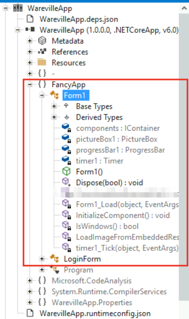
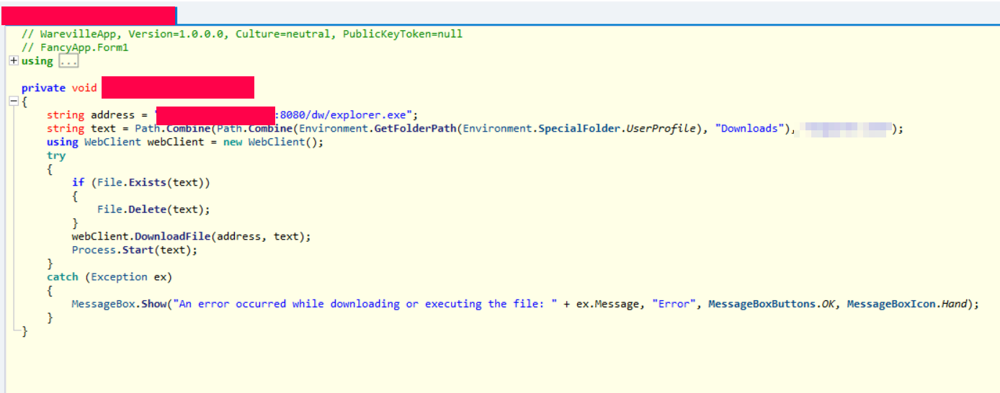
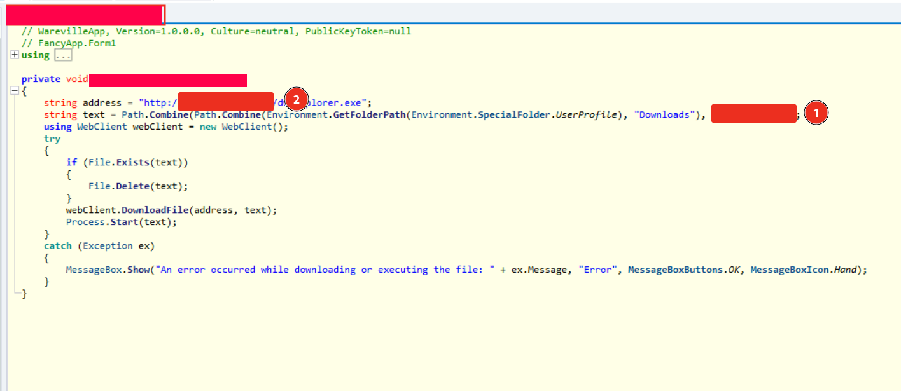
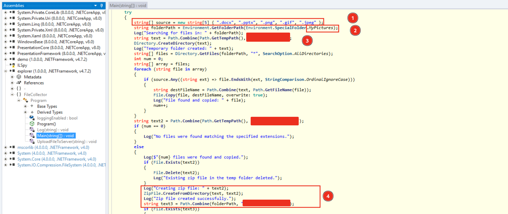
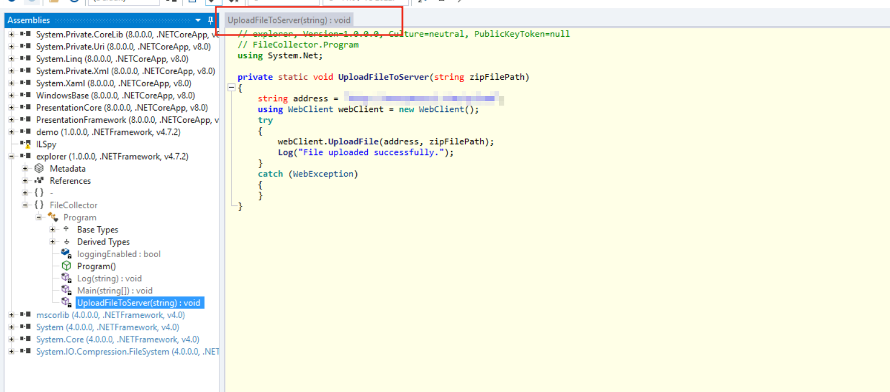

# Advent of Cyber 2024 Writeup: Day 21

## Overview
**Room URL:** https://tryhackme.com/r/room/adventofcyber2024 \
**Difficulty:** Easy\
**Category:** Reverse Engineering\
**Date Completed:** 12/24/2024

### Objectives
1. Understanding the structure of a binary file 
2. The difference between Disassembly vs Decompiling
3. Familiarity with multi-stage binaries
4. Practically reversing a  multi-stage binary

---

## Table of Contents
1. [Introduction](#introduction)  
2. [Walkthrough](#walkthrough)  
   - [Task 27: HELP ME...I'm REVERSE ENGINEERING!](#task-27-help-meim-reverse-engineering)  
3. [Lessons Learned](#lessons-learned)  
4. [References](#references)

---

## Introduction
In this task we'll use `PEstudio` and `ILSpy` to decompile Windows binaries in order to reverse engineer a malware. Windows binaries follow the `Portable Executable (PE)` structure whereas Linux binaries follow the `Executable and Linkable (ELF)` format. 

---

## Walkthrough

### Task 27: HELP ME...I'm REVERSE ENGINEERING!

#### Sub-Question: What is the function name that downloads and executes files in the WarevilleApp.exe?
  - **Steps Taken:** On loading `ILSpy` and opening the `WarevilleApp.exe`. If we expand the tree as `FancyApp -> Form1`, we'll see all the functions used by the `Form1` object. One of which is our answer.
  - **Output/Result:**  
        

#### Sub-Question: Once you execute the WarevilleApp.exe, it downloads another binary to the Downloads folder. What is the name of the binary?
  - **Steps Taken:** Following from the function found in the above stage, we can see that it uses the `WebClient` class to download a binary whose path is saved as a `text` variable.
  - **Output/Result:**  
       

#### Sub-Question: What domain name is the one from where the file is downloaded after running WarevilleApp.exe?
  - **Steps Taken:** The answer to this is also in the same function as in the above question saved to the `address` variable and passed to the `WebClient` class to download the binary.
  - **Output/Result:**  
       

#### Sub-Question: The stage 2 binary is executed automatically and creates a zip file comprising the victim's computer data; what is the name of the zip file?
  - **Steps Taken:** Since we're on a sandbox environment, we can execute the `WarevilleApp.exe` binary which will automatically download the `Payload` from the malicious domain. If we use `ILSpy` to then open the Payload, we can see how it works. From the `Main` function, we see that it looks at the `MyPictures` folder in windows and tries to find files with common file extensions. It then creates a folder to add these files and finally zips them with a pre-specified name which is our answer.
  - **Output/Result:**  
       
   
   #### Sub-Question: What is the name of the C2 server where the stage 2 binary tries to upload files?
  - **Steps Taken:** One other interesting function in the `FileCollector` is the `UploadFileToServer` function which contains the address of the C2 server.
  - **Output/Result:**  
       

---

## Lessons Learned

- Learnt about `Disassembly` which is the process of converting binaries to accurate assembly-language instructions using tools such as `IDA`, `Ghidra` and `GDB`.

- Learnt about `Decompiling` which is the process of converting binaries to a "best-guess" high-level code such as `C++` or `C#` using tools like `ILSpy`

- Learnt about how the use of multi-stage binaries i.e dividing a malware into multiple binaries can help malicious actors avoid detection and have a better chance of compromising a system.

- Learnt about the importance of validating hashes of the `.text` section to ensure no alteration has been made during the investigation.
---

## References
