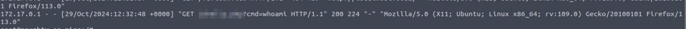
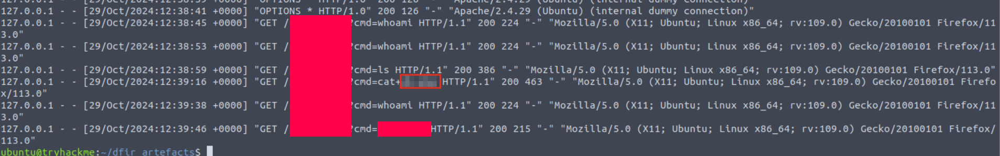
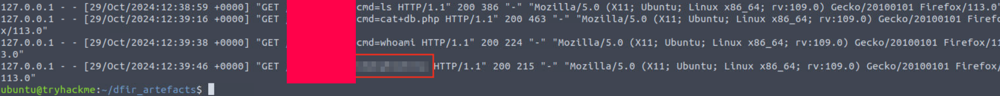
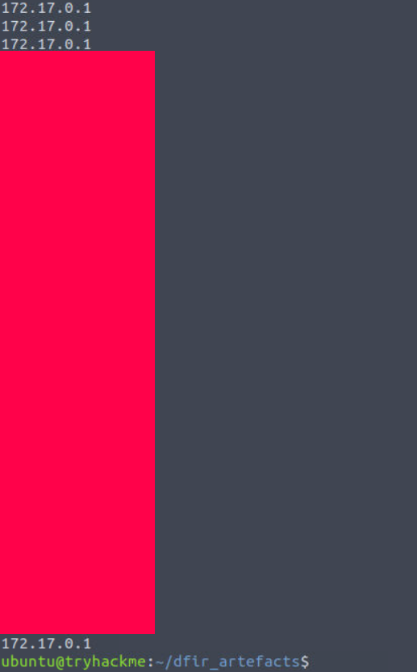
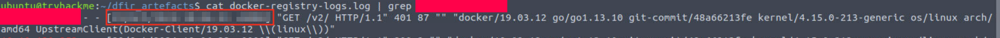
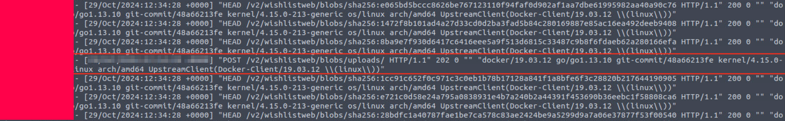
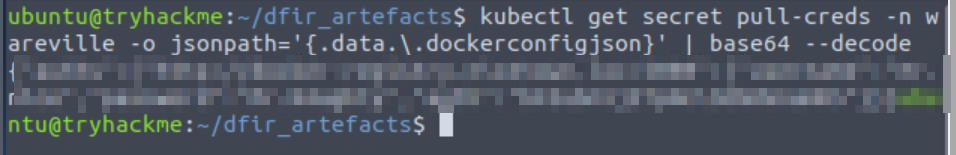

# Advent of Cyber 2024 Writeup: Day 22

## Overview
**Room URL:** https://tryhackme.com/r/room/adventofcyber2024 \
**Difficulty:** Easy\
**Category:** Kubernetes DFIR\
**Date Completed:** 12/24/2024

### Objectives
1. Learn about Kubernetes, what it is and why it is used.
2. Learn about DFIR, and the challenges that come with DFIR in an ephemeral environment.
3. Learn how DFIR can be done in a Kubernetes environment using log analysis.

---

## Table of Contents
1. [Introduction](#introduction)  
2. [Walkthrough](#walkthrough)  
   - [Task 28: It's because I'm kubed, isn't it?](#task-28-its-because-im-kubed-isnt-it)  
3. [Lessons Learned](#lessons-learned)  
4. [References](#references)

---

## Introduction
This task focuses on performing DFIR on `Kubernetes`.

As an organization grows, it is not necessary that demand of every service grows at the same pace. Hence, organizations are increasingly adopting microservice architecture to meet demand of targeted services. These microservices use containers for hosting them, however with an application broken down into thousands of services, it also required thousands of containers to host them. 

`Kubernetes` was developed to manage these containers by creating and disposing containers based on demand and balancing traffic between containers. In kubernetes, containers run in `pods`, pods run in `nodes` and a collection of nodes make up a kubernetes `cluster`.

However, Kubernetes containers usually have a very short lifespan, making investigation challenging. This can be solved by enabling `Kubenetes audit logging` so that API requests can be logged at various stages.

---

## Walkthrough

### Task 28: It's because I'm kubed, isn't it?

#### Sub-Question: What is the name of the webshell that was used by Mayor Malware?
  - **Steps Taken:** On accessing the logs of the `apache` server using the command `cat /var/logs/apache2/access.log`, the last log gives us the the name of the reverse shell used.
  - **Output/Result:**  
        

#### Sub-Question: What file did Mayor Malware read from the pod?
  - **Steps Taken:** Since the webserver access logs are not enough, we have to rely on the backups of logs made by the webserver. Navigating to `/home/ubuntu/dfir_artefacts/`, we can view the backup logs stored in `pod_apache2_access.log` to find the answer.
  - **Output/Result:**  
        

#### Sub-Question: What tool did Mayor Malware search for that could be used to create a remote connection from the pod?
  - **Steps Taken:** This answer is also provided by the backup log in the question above prefaced by a `which` command.
  - **Output/Result:**  
        

#### Sub-Question: What IP connected to the docker registry that was unexpected?
  - **Steps Taken:** Since we can't find the actual IP address that was used to connect to the instance because the pod was configured using a port forward, we have to think of something else. Fortunately `docker` logs requests which can be viewed using the command `cat docker-registry-logs.logs | grep "HEAD" | cut -d ' ' -f 1`. The `cut` command gives us just the IP address making our output cleaner. 
  - **Output/Result:**  
        
    
#### Sub-Question: At what time is the first connection made from this IP to the docker registry?
  - **Steps Taken:** We can use the command `cat docker-registry-logs.logs | grep "<Suspicious-IP>"` and scroll to the top for our answer. 
  - **Output/Result:**  
        

#### Sub-Question: At what time is the updated malicious image pushed to the registry?
  - **Steps Taken:** Using the same command as above, if we look for the first `PUT` request, that timestamp is our answer.
  - **Output/Result:**  
        

#### Sub-Question: What is the value stored in the "pull-creds" secret?
  - **Steps Taken:** After investigating, we find that mayor malware's account had the permission to use `pods/exec`. This allowed the mayor to shell into containers running within the pod. The mayor enumerated roles to find a `job-runner` role that was bound to a service account `job-runner-sa`.  After enumerating the pods, he finds that a pod `morality-checker` runs with the `job-runner-sa` service account attached. So he `shells` into the service account which effectively escalates his privileges giving him access to the `pull-creds` secret. 
  The secret here can be found by running the command: `kubectl get secret pull-creds -n wareville -o jsonpath='{.data.\.dockerconfigjson}' | base64 --decode`
  - **Output/Result:**  
        

---

## Lessons Learned

- Learnt about `DFIR` disciplines of `Digital Forensics` which aims to collect and analye digital evidence of an incident after it has occured and `Incident Response` which focuses on responsive actions such as threat containment and system recovery. 

- In a `DFIR` context the following questions are important:
    - What happened?
    - When did it happen?
    - Who initiated it?
    - To what did it happen?
    - Where was it observed?
    - From where was it initiated?
    - To where was it going?

---

## References
