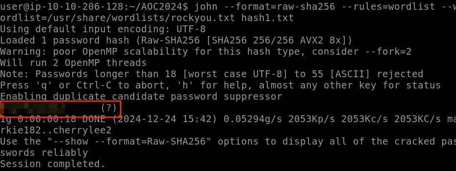
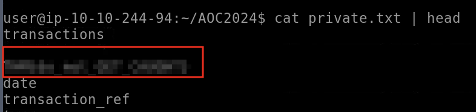

# Advent of Cyber 2024 Writeup: Day 23

## Overview
**Room URL:** https://tryhackme.com/r/room/adventofcyber2024 \
**Difficulty:** Easy\
**Category:** Hash cracking\
**Date Completed:** 12/24/2024

### Objectives
1. Hash functions and hash values
2. Saving hashed passwords
3. Cracking hashes
4. Finding the password of a password-protected document

---

## Table of Contents
1. [Introduction](#introduction)  
2. [Walkthrough](#walkthrough)  
   - [Task 29: You wanna know what happens to your hashes?](#task-29-you-wanna-know-what-happens-to-your-hashes)  
3. [Lessons Learned](#lessons-learned)  
4. [References](#references)

---

## Introduction
This task focuses on cracking hashes using `John the Ripper`. First we have to identify the type of the hash and then decide on a wordlist. `John` also allows us to use `rules` to improve its working by modifying the words in the wordlist in common ways like altering a character for a similar looking number, changing the case etc.

---

## Walkthrough

### Task 29: You wanna know what happens to your hashes?

#### Sub-Question: Crack the hash value stored in hash1.txt. What was the password?
  - **Steps Taken:** Running the command `john --format=raw-sha256 --rules=wordlist  --wordlist=/usr/share/wordlist/rockyou.txt hash1.txt`, cracks our hash to give us the answer.
  - **Output/Result:**  
        

#### Sub-Question: What is the flag at the top of the private.pdf file?
  - **Steps Taken:** We'll first get a password hash for the protected pdf and save it in `pdf.hash` using `pdf2john.pl private.pdf > pdf.hash`. After that, we can use the command `john --rules=single --wordlist=wordlist.txt pdf.hash` to crack the hash. We can then convert the pdf to text file using the command `pdftotext private.pdf -upw PASSWORD` and finally view the first few lines of the converted file using the command `cat private.txt | head` to find the answer. 
  - **Output/Result:**  
      

---

## Lessons Learned
- Learnt about using `John the Ripper` to crack password hashes using wordlists and rules to enhance the process.

- Learnt about extracting password hashes from password protected documents which can then be cracked. 

---

## References
