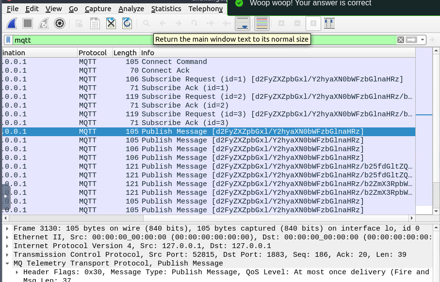
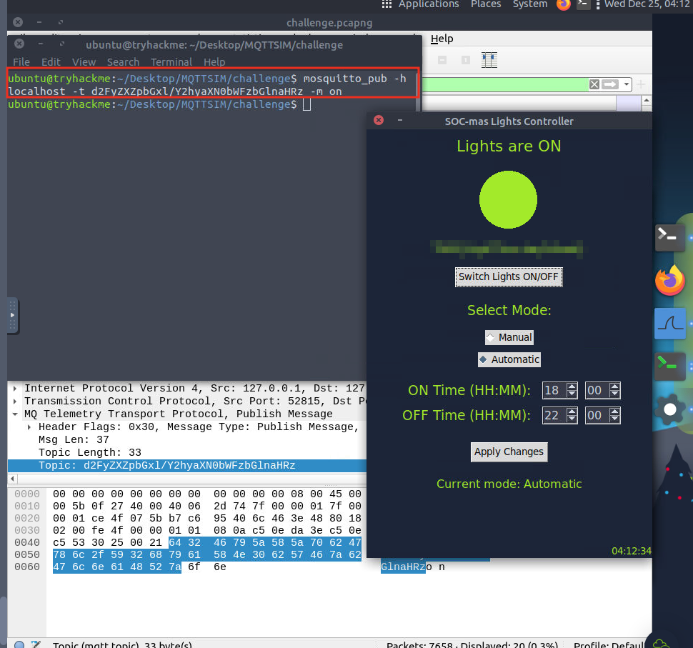

# Advent of Cyber 2024 Writeup: Day 24

## Overview
**Room URL:** https://tryhackme.com/r/room/adventofcyber2024 \
**Difficulty:** Easy\
**Category:** Communication Protocols\
**Date Completed:** 12/25/2024

### Objectives
1. The basics of the MQTT protocol
2. How to use Wireshark to analyze MQTT traffic
3. Reverse engineering a simple network protocol

---

## Table of Contents
1. [Introduction](#introduction)  
2. [Walkthrough](#walkthrough)  
   - [Task 30: You can’t hurt SOC-mas, Mayor Malware!](#task-30-you-cant-hurt-soc-mas-mayor-malware)  
3. [Lessons Learned](#lessons-learned)  
4. [References](#references)

---

## Introduction
This task focuses on the `Message Queuing Telemetry Transport (MQTT)` protocol. This protocol is used by `IoT` devices and works on the `publish/subscribe` model. 

---

## Walkthrough

### Task 30: You can’t hurt SOC-mas, Mayor Malware!

#### Sub-Question: What is the flag?
  - **Steps Taken:** I opened up the `challenge.pcapng` file in `Wireshark`. Then I filtered for `MQTT packets` only. Based on the demonstration, I looked at the `Publish Message` packet which contains the `MQTT topic`. Then as instructed in the task, I used the command `mosquitto_pub -h localhost -t "d2FyZXZpbGx1/Y2hyaXNObWFzbGlnaHRz" -m on` to turn on the light switches. The flag was displayed in the lights controller interface.
  - **Output/Result:**  
        
        

---

## Lessons Learned

- Learnt about the `MQTT` communication and its constituents. It consists of `MQTT Clients` that publish or subscribe to messages using the MQTT protocol, `MQTT Broker` that receives messages from publishing clients and distributes them to the subscribing clients based on their preferences and `MQTT Topics` which are used by clients to indicate the types of messages they are interested in. 

---

## References
