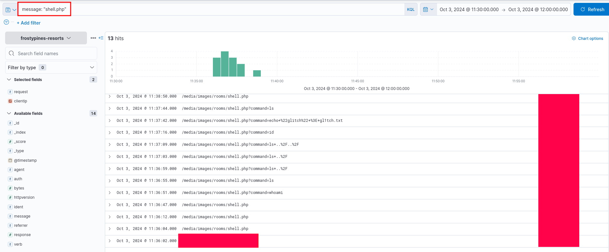
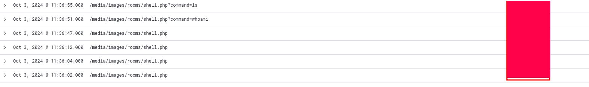
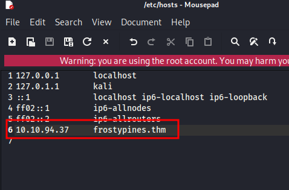
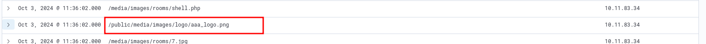
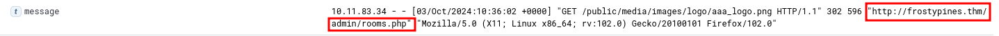
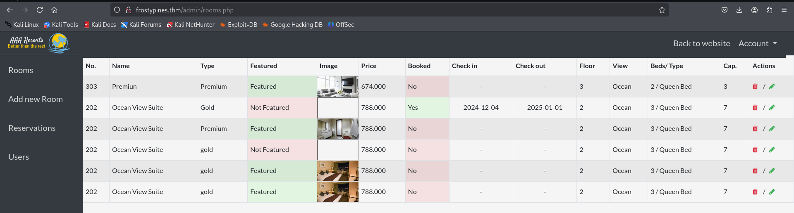
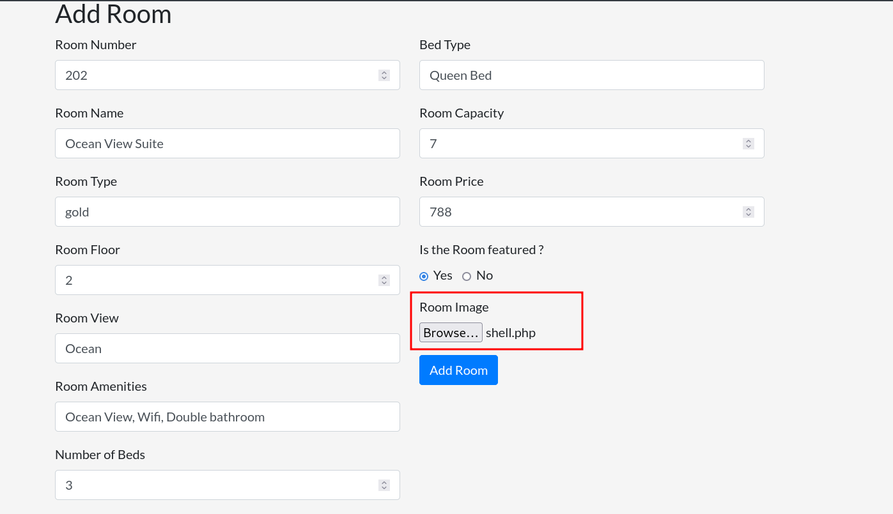
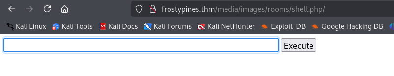
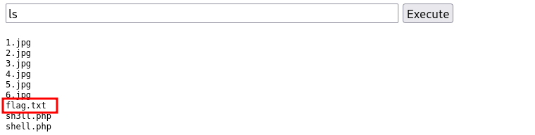
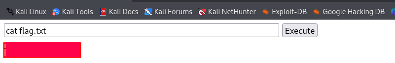

# Advent of Cyber 2024 Writeup: Day 3

## Overview
**Room URL:** https://tryhackme.com/r/room/adventofcyber2024 \
**Difficulty:** Easy\
**Category:** Log Analysis\
**Date Completed:** 12/04/2024

### Objectives
1. Learn about Log analysis and tools like ELK.
2. Learn about KQL and how it can be used to investigate logs using ELK.
3. Learn about RCE (Remote Code Execution) and how this can be done via insecure file upload.

---

## Table of Contents
1. [Introduction](#introduction)   
2. [Walkthrough](#walkthrough)  
   - [Task 9: Even if I wanted to go, their vulnerabilities wouldn't allow it.](#task-9-even-if-i-wanted-to-go-their-vulnerabilities-wouldnt-allow-it)  
3. [Lessons Learned](#lessons-learned)  
4. [References](#references)

---

## Introduction
This task is a mixture of both blue and red team activities where we can get both defensive and offensive perspectives of a web attack involving a web shell. First, we will use ELK to analyze the logs of a web app and figure out how the attacker gained Remote Code Execution Access to the system. Then we'll use the web shell script provided and upload it as a file upload to the website to gain RCE access in the same way. In this process, we'll figure out what is the vulnerability in the web application and can notify the blue team about it.

---

## Walkthrough

### Task 9: Even if I wanted to go, their vulnerabilities wouldn't allow it.

#### Sub-Question (BLUE): Where was the web shell uploaded to?
  - **Steps Taken:** In order to find the answer to this, we'll simply use KQL in the search bar as `message: "shell.php"`. This will allow us to narrow down to events where the message field contains `shell.php`.
  - **Output/Result:**  
        
  - **Answer:** `/media/images/rooms/shell.php`

#### Sub-Question (BLUE): What IP address accessed the web shell?
  - **Steps Taken:** If we observe the `clientip` field, we'll see that only two ip addresses interact with the `shell.php` page. Seems like one of them  (`10.9.254.186`) just accidentally stumbles upon it. The other IP address (`10.11.83.34`) is seen using the shell to execute commands on the web server. Hence this is our malicous actor.
  - **Output/Result:**  
        
  - **Answer:** `10.11.83.34`

#### Sub-Question (RED): What is the contents of the flag.txt?
  - **Steps Taken:** Now we're switching sides from blue to red. First we have to add the domain and IP address to our `/etc/hosts` file in order to access it. \
       \
  Since we know the malicious IP, let us filter the results to narrow down our search. \
      \
  Observing the first instance of the shell being accessed we see the same malicious IP requesting another location on the page.
      \
  Expanding on that log, we see that the `referrer` field shows an admin page. Hence we know that the malicious actor was on the admin page before requesting the current page. \
     
  I tried to access that admin panel and turns out it's not protected. Hence I land on the `admin/rooms.php` page. \
      \
  Then I tried to add a room and that's where I saw a field that accepts user file uploads. Looking into it in greater detail, it allows unrestricted file upload, so I can upload any type of file not just `.PNG` or `.JPG` files. I uploaded the `shell.php` file provided. \
      \
  Again, turning to logs in ELK, we can find the location of the reverse shell. Going to that path after the web shell has been uploaded, we see the web shell ready to execute remote commands. Hence RCE has been achieved. \
      \
  Looking at the files with the `ls`, we can see a `flag.txt` file which is what we need for the answer. \
     
     

---

## Lessons Learned
- Learned how web shells and RCE are detected using ELK.
- Learned how web shells can be uploaded when unrestricted user file upload is enabled in the website.

---

