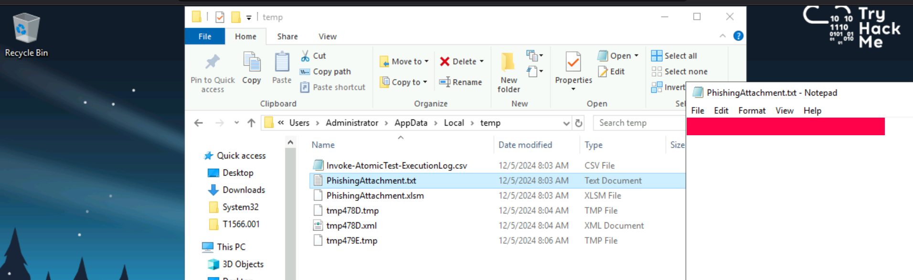
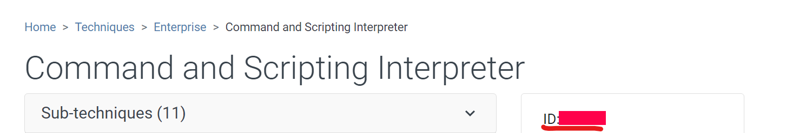
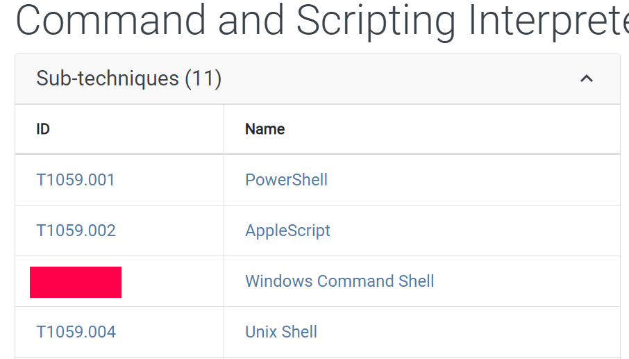
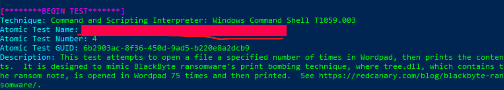
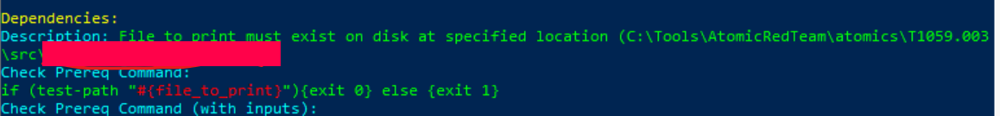
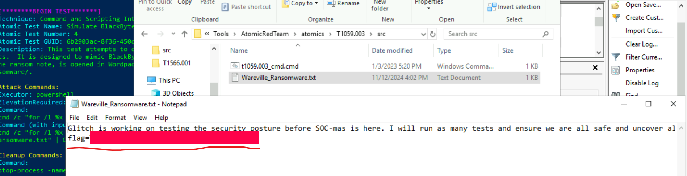

# Advent of Cyber 2024 Writeup: Day 4

## Overview
**Room URL:** https://tryhackme.com/r/room/adventofcyber2024 \
**Difficulty:** Easy\
**Category:** Atomic Red Team\
**Date Completed:** 12/05/2024

### Objectives
1. Learn how to identify malicious techniques using the MITRE ATT&CK framework.
2. Learn about how to use Atomic Red Team tests to conduct attack simulations.
3. Understand how to create alerting and detection rules from the attack tests.

---

## Table of Contents
1. [Introduction](#introduction)  
2. [Walkthrough](#walkthrough)  
   - [Task 10:  I’m all atomic inside!](#task-10-im-all-atomic-inside)  
3. [Lessons Learned](#lessons-learned)  
4. [References](#references)

---

## Introduction
This task focuses on using **Atomic Red Team** tests in order to emulate MITRE tactics and techniques as part of a blue team exercise. As blue-teamers, it is important recognize that no system is free from detection gaps. These gaps may be huge or small but they always exist and it is our responsibility to refine and improve detection rules to close these gaps as much as possible. Atomic Red Team is one such way to achieve this. It consists of red team test cases mapped to the MITRE ATT&CK framework which will allow us to identify detection gaps and use these to craft appropriate detection and alerting rules.

---

## Walkthrough

### Task 10: I’m all atomic inside!

#### Sub-Question: What was the flag found in the .txt file that is found in the same directory as the PhishingAttachment.xslm artefact?
  - **Steps Taken:** This question is part of the tutorial. The flag is easy to get just by going to the path specified and opening the `PhishingAttachment.txt` file.
  - **Output/Result:**  
        

#### Sub-Question: What ATT&CK technique ID would be our point of interest?
  - **Steps Taken:** Based on the focus of the question on `a command and scripting interpreter`, I decided to go to the MITRE ATT&CK website and search for this exact key-word which led me to the answer.
  - **Output/Result:**  
        

#### Sub-Question: What ATT&CK subtechnique ID focuses on the Windows Command Shell?
  - **Steps Taken:** Just expanding the `Sub-Techniques` section, I found the appropriate subtechnique focusing on Windows.
  - **Output/Result:**  
        

#### Sub-Question: What is the name of the Atomic Test to be simulated?
  - **Steps Taken:** Now we know from the question that we are to mimic a ransomware attack and we also know the subtechnique for the correct atomic test. Based on this I tried to find the relevant test number as `Invoke-AtomicTest <Previous Answer> -ShowDetails`. Scrolling a little I found the answer.
  - **Output/Result:**  
        

#### Sub-Question: What is the name of the file used in the test?
  - **Steps Taken:** Browsing the dependencies section of this test, there is a description field where it states the file path that will be used for print bombing which contains the file name.
  - **Output/Result:**  
        

#### Sub-Question: What is the flag found from this Atomic Test?
  - **Steps Taken:** Going to the file path found in the description section of dependencies for the test number and opening the `<Previous Answer>`, I got the flag.
  - **Output/Result:**  
        

---

## Lessons Learned
- Learned about Unified Cyber Kill Chain and MITRE ATT&CK Framework. 
- Learned about the need for constantly updating alerting and detection rules.
- Learned about running atomic to emulate MITRE ATT&CKs and cleaning up the machine to restore it to the previous state.  

---

## References
1. [MITRE ATT&CK Framework](https://attack.mitre.org/)
