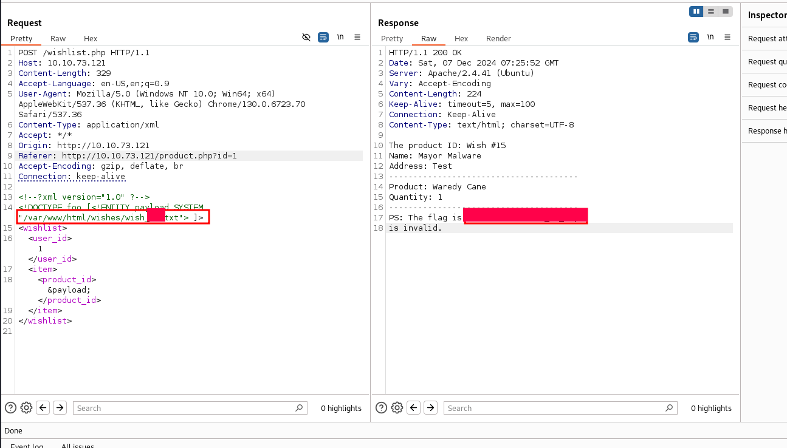
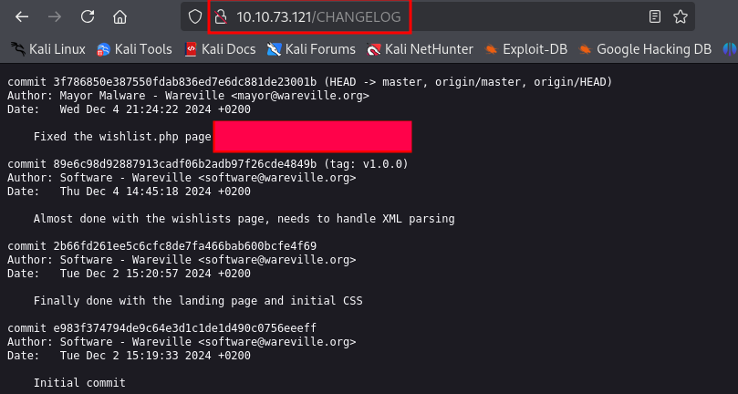

# Advent of Cyber 2024 Writeup: Day 5

## Overview
**Room URL:** https://tryhackme.com/r/room/adventofcyber2024 \
**Difficulty:** Easy\
**Category:** XML External Entity (XXE)\
**Date Completed:** 12/07/2024

### Objectives
1. Understand the basic concepts related to XML.
2. Explore XML External Entity (XXE) and its components.
3. Learn how to exploit the vulnerability.
4. Understand remediation measures.

---

## Table of Contents
1. [Introduction](#introduction)
2. [Walkthrough](#walkthrough)  
   - [Task 11: SOC-mas XX-what-ee?](#task-11-soc-mas-xx-what-ee)  
3. [Lessons Learned](#lessons-learned)  
4. [References](#references)

---

## Introduction
This task is a red team task where we're asked to exploit XXE vulnerability. **XXE** is a vulnerability that occurs in Extensible Markup Language (XML) when it tries to load external entities. The blueprint of an XML file is called the **Document Type Definition (DTD)** which defines what tags and attributes are allowed in an XML file. An **entity** in XML are basically variables whose value can either be internally or externally defined. The external entities when not properly configured can lead to XXE vulnerability. 

The procedure for defining an external entity in XML is as below:
```xml
  <!DOCTYPE people [
    <!ENTITY ext SYSTEM "some file">
  ]>

  <people>
    <name>&ext;</name>
  </people>
```
Here, `ext` is an external entity that is loaded into the XML file.

---

## Walkthrough

### Task 11: SOC-mas XX-what-ee?

#### Sub-Question: What is the flag discovered after navigating through the wishes?
 - **Steps Taken:** The task basically walks us through injecting an `XXE` payload into the vulnerable website. We find that we can manipulate the value of the `<product_id>` element by updating the XML to include the provided code. Also during checkout, we were given a Wish number of 21, so we can assume that there are 20 wishes that have already been made. To find the flag, we can enumerate through the `/var/www/html/wishes/wish_xx.txt` where `xx` represents the wish number. I used Burp suite's repeater for this but using the Intruder would be the proper way to do this.
  - **Output/Result:**  
        

#### Sub-Question: What is the flag seen on the possible proof of sabotage?
  - **Steps Taken:** This part of the question is also solved in the walkthrough itself. We are led to the `CHANGELOG` page of the site which has the commit history for the website. That's where we find the flag. 
  - **Output/Result:**  
        
---

## Lessons Learned
- Learned about XXE and how to prevent it by doing proper input sanitization and disabling exteranl entity loading.
- Learned about configuring Burp suite and using its features like Proxy and Repeater.

---

## References
1. [Burp suite](https://portswigger.net/burp/documentation/desktop)
