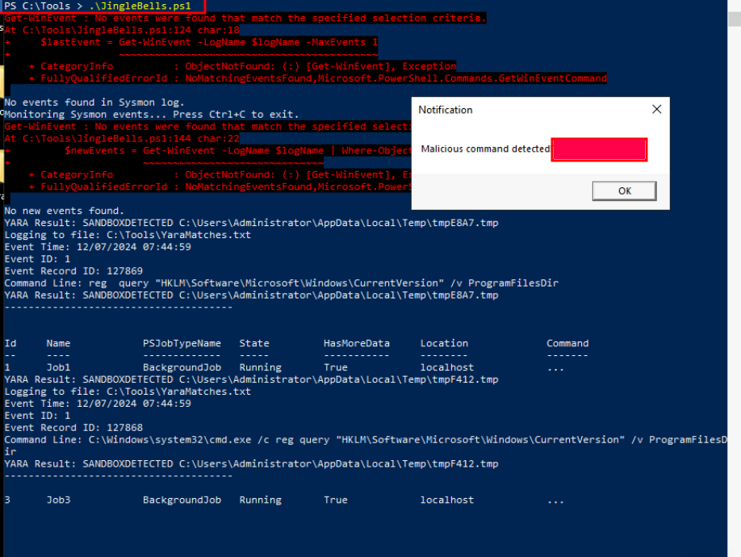
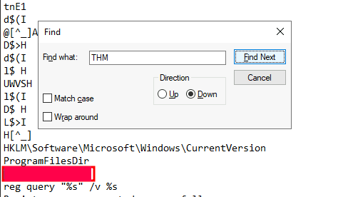

# Advent of Cyber 2024 Writeup: Day 4

## Overview
**Room URL:** https://tryhackme.com/r/room/adventofcyber2024 \
**Difficulty:** Easy\
**Category:** Sandboxes\
**Date Completed:** 12/07/2024

### Objectives
1. Analyze malware behaviour using sandbox tools.
2. Explore how to use YARA rules to detect malicious patterns.
3. Learn about the various malware evasion techniques.
4. Implement an evasion technique to bypass YARA rule detection.

---

## Table of Contents
1. [Introduction](#introduction)
2. [Walkthrough](#walkthrough)  
   - [Task 12: If I can't find a nice malware to use, I'm not going.](#task-12-if-i-cant-find-a-nice-malware-to-use-im-not-going)  
3. [Lessons Learned](#lessons-learned)  
4. [References](#references)

---

## Introduction
This task is focused on the importance of sandboxes for detecting and analyzing malware behavior.
We'll also learn about filtering `Sysmon` Logs using the logs created by the EDR when it detects malware based on the `YARA` rule that we apply.

---

## Walkthrough

### Task 12: If I can't find a nice malware to use, I'm not going.

#### Sub-Question: What is the flag displayed in the popup window after the EDR detects the malware?
  - **Steps Taken:** The task walks us through running both the EDR, `JingleBells.ps1` and the malware `MerryChristmas.exe`. The EDR configured with the YARA rule will detect and show a popup notification to inform us about the running malware.
  - **Output/Result:**  
        

#### Sub-Question: What is the flag found in the malstrings.txt document after running floss.exe, and opening the file in a text editor?
  - **Steps Taken:** This part was confusing because nothing came up when searching the string provided by the question. So I directly searched for the flag.
  - **Output/Result:**  
        

---

## Lessons Learned
- The presence of a sandbox environment can be checked by querying the Registry path `HKLM\\Software\\Microsoft\\Windows\\CurrentVersion`. A sandbox doesn't have a `C:\\Program Files` directory.

- Learned about configuring `EDRs` with `YARA` rules to enforce detection of known code patterns in malware. The information provided by YARA can be used to improve and enforce malware detection of `Sysmon` logs. 

- Learned about obfuscation as an evasion technique to avoid detection.

- Learned about `Floss` tool which detects obfuscated code in malware binaries. 

---

## References
