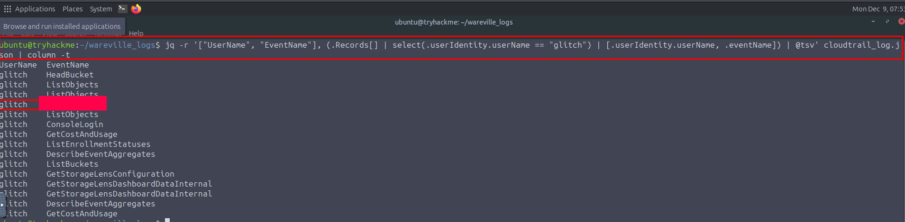
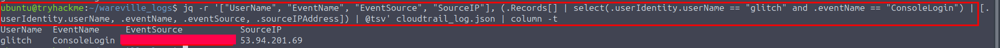
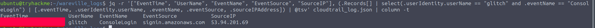
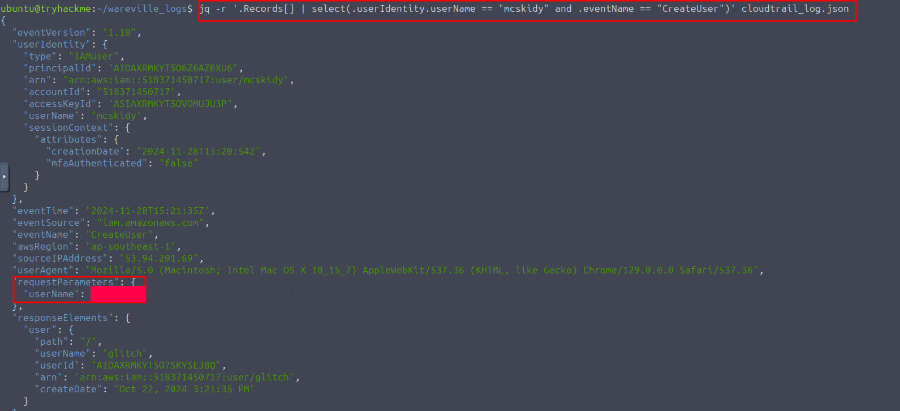
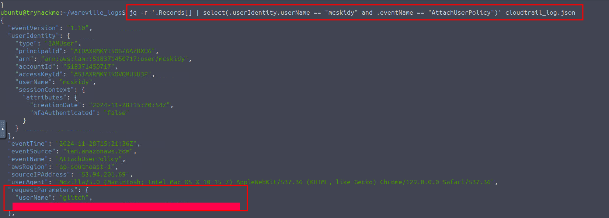
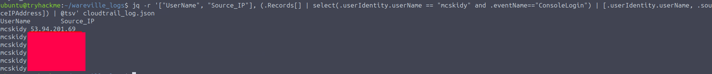
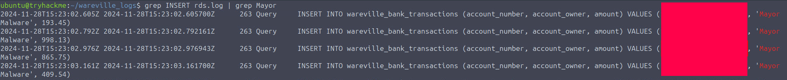

# Advent of Cyber 2024 Writeup: Day 7

## Overview
**Room URL:** https://tryhackme.com/r/room/adventofcyber2024 \
**Difficulty:** Easy\
**Category:** AWS Log Analysis\
**Date Completed:** 12/09/2024

### Objectives
1. Learn about monitoring logs in AWS.
2. Learn about processing `JSON` files using `jq` in the command line.
3. Learn about Cloudwatch and Cloudtrail.

---

## Table of Contents
1. [Introduction](#introduction)  
2. [Walkthrough](#walkthrough)  
   - [Task 13: Oh, no. I'M SPEAKING IN CLOUDTRAIL!](#task-13-oh-no-im-speaking-in-cloudtrail)  
3. [Lessons Learned](#lessons-learned)  
4. [References](#references)

---

## Introduction
As more and more companies migrate to the cloud, it is essential to understand how logs are processed and analyzed in the cloud. AWS is a major cloud service provider that provides features such as **CloudWatch** and **CloudTrail** for the monitoring and security of applications. The major difference between these two is that, CloudWatch focuses on the performance and health of resources whereas CloudTrail tracks user activity and API usage for security and compliance. In this task, we'll be familiar with using CloudTrail with a handy tool called `jq` to analyze CloudTrail logs which are JSON-formatted.

---

## Walkthrough

### Task 13: Oh, no. I'M SPEAKING IN CLOUDTRAIL!

#### Sub-Question: What is the other activity made by the user glitch aside from the ListObject action?

- **Steps Taken:**
    - **Command Action:**
        ```bash
            jq -r '["UserName", "EventName"], (.Records[] | select(.userIdentity.userName == "glitch") | [.userIdentity.userName, .eventName]) | @tsv' cloudtrail_log.json | column - t
        ```
    - **Explanation:** This command lists the `UserName` and `EventName` of log events in the log file in a tabular format. This shows us that the user `glitch` did a number of events but the question is probably looking for just one of them. 
- **Output/Result:** 

#### Sub-Question: What is the source IP related to the S3 bucket activities of the user glitch?

- **Steps Taken:**
    - **Command Action:**
        ```bash
            jq -r '["UserName", "EventName", "EventSource", "SourceIP"], (.Records[] | select(.userIdentity.userName == "glitch" and .eventSource == "s3.amazonaws.com") | [.userIdentity.userName, .eventName, .eventSource, .sourceIPAddress]) | @tsv' cloudtrail_log.json | column - t
        ```
    - **Explanation:** This command tabulates the S3 bucket activities of the user `glitch` and lists all the IP addresses associated with these activities.
- **Output/Result:** 

#### Sub-Question: Based on the eventSource field, what AWS service generates the ConsoleLogin event?

- **Steps Taken:**
    - **Command Action:**
        ```bash
            jq -r '["UserName", "EventName", "EventSource", "SourceIP"], (.Records[] | select(.userIdentity.userName == "glitch" and .eventName == "Consolelogin") | [.userIdentity.userName, .eventName, .eventSource, .sourceIPAddress]) | @tsv' cloudtrail_log.json | column - t
        ```
    - **Explanation:** This command looks at the `eventSource` field associated with `ConsoleLogin` event of a user. 
- **Output/Result:** 

#### Sub-Question: When did the anomalous user trigger the ConsoleLogin event?

- **Steps Taken:**
    - **Command Action:**
        ```bash
            jq -r '["EventTime", "UserName", "EventName", "EventSource", "SourceIP"], (.Records[] | select(.userIdentity.userName == "glitch" and .eventName == "Consolelogin") | [.eventTime, .userIdentity.userName, .eventName, .eventSource, .sourceIPAddress]) | @tsv' cloudtrail_log.json | column - t
        ```
    - **Explanation:** Adding the `eventTime` field on to the previous command, we can see the timestamp of the login event.
- **Output/Result:** 

#### Sub-Question: What was the name of the user that was created by the mcskidy user?

- **Steps Taken:**
    - **Command Action:**
        ```bash
            jq -r '.Records[] | select(.userIdentity.userName == "mcskidy" and .eventName == "CreateUser")' cloudtrail_log.json
        ```
    - **Explanation:** This command searches the Cloudtrail log file for the event describing `mcskidy` creating a user. We can see the name of the created user in the `requestParameters.userName` field returned by the command.
- **Output/Result:** 

#### Sub-Question: What type of access was assigned to the anomalous user?

- **Steps Taken:**
    - **Command Action:**
        ```bash
            jq -r '.Records[] | select(.userIdentity.userName == "mcskidy" and .eventName == "AttachUserPolicy")' cloudtrail_log.json
        ```
    - **Explanation:** This command searches the Cloudtrail log file for the event describing `mcskidy` granting access to users. We can see the name of the created user and level of access in the `requestParameters.userName` and `requestParameters.policyArn` fields returned by the command.
- **Output/Result:** 

#### Sub-Question: Which IP does Mayor Malware typically use to log into AWS?

- **Steps Taken:**
    - **Command Action:**
        ```bash
            jq -r '["UserName", "Source_IP"], (.Records[] | select(.userIdentity.userName == "mayor_malware" and .eventName == "Consolelogin") | [.userIdentity.userName, .sourceIPAddress]) | @tsv' cloudtrail_log.json
        ```
    - **Explanation:** This command lists all the IP addresses associated with Mayor Malware's logins. As we can see there's only one unique IP.
- **Output/Result:** 

#### Sub-Question: What is McSkidy's actual IP address?

- **Steps Taken:**
    - **Command Action:**
        ```bash
            jq -r '["UserName", "Source_IP"], (.Records[] | select(.userIdentity.userName == "mcskidy" and .eventName == "Consolelogin") | [.userIdentity.userName, .sourceIPAddress]) | @tsv' cloudtrail_log.json
        ```
    - **Explanation:** This command lists the IP used by `mcskidy` to log in to AWS. There are two different IP addresses. However, the previous one is known to be used by `Mayor Malware` so the latter one is the actual IP address.
- **Output/Result:** 

#### Sub-Question: What is the bank account number owned by Mayor Malware?

- **Steps Taken:**
    - **Command Action:**
        ```bash
            grep INSERT rds.log | grep Mayor
        ```
    - **Explanation:** We can search the log provided by the bank for mentions of both `INSERT` and `Mayor` to find events where money was deposited to the mayor's account. 
- **Output/Result:** 

---

## Lessons Learned
- Learned about the usage of `jq` to process JSON-formatted logs.
- Learned about `AWS CloudWatch` and `AWS CloudTrail` and how they come together to monitor cloud activities.

---

## References