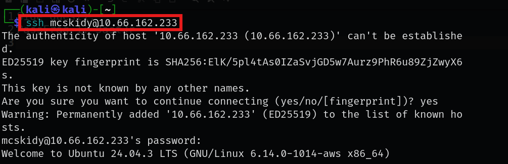
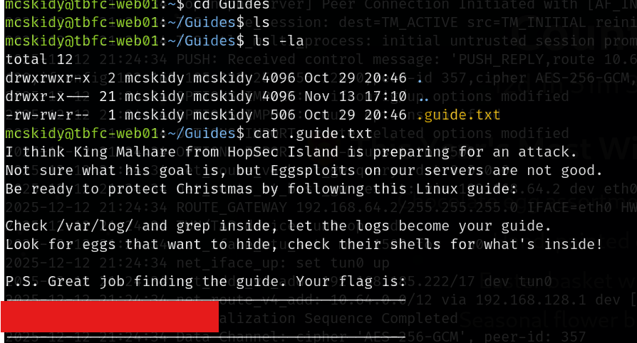
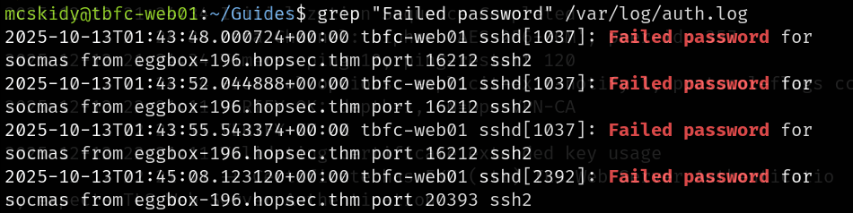
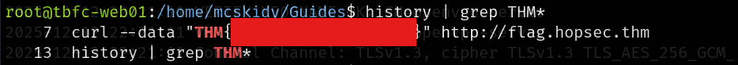

# Advent of Cyber 2025 Writeup: Day 1

## Overview
**Room URL:** https://tryhackme.com/room/linuxcli-aoc2025-o1fpqkvxti \
**Difficulty:** Easy\
**Category:** Linux\
**Date Completed:**  12/12/2025

### Objectives
1. To learn the basics of the Linux command-line interface (CLI)
2. To explore its use for personal objectives and IT administration.
---

## Table of Contents
1. [Introduction](#introduction)   
2. [Walkthrough](#walkthrough)  
   - [Task 1: Introduction](#task-1-introduction)
   - [Task 2: Linux CLI](#task-2-working-with-the-linux-cli)
---

## Introduction
This is the first room for Advent of Cyber 2025 that goes over linux basics. It gives an introduction to basic CLI commands like `find`, `ls` and `cat`. 

---

## Walkthrough
### Task 1: Introduction
This task is just about connecting to the machine. I spawned a machine and used ssh to access it from my `kali` machine.

### Task 2: Working With the Linux CLI 
#### Sub-Question 1: Which CLI command would you use to list a directory? 
- **Steps Taken:** I simply used the `ls` command to list the directory while finding the hidden guide left by Mcskidy.
- **Output/Result:** 

#### Sub-Question 2: Which command helped you filter the logs for failed logins? 
- **Steps Taken:** I used the `grep` command to find Failed password attempts for socmas.
- **Output/Result:** 

#### Sub-Question 3: Which command would you run to switch to the root user? 
- **Steps Taken:** I used the `sudo su` command to switch to the root user.
- **Output/Result:** 
#### Sub-Question 4: Finally, what flag did Sir Carrotbane leabe in the root bash history?
- **Steps Taken:** I used the `history` command to list the commands used by Sir Carrotbane.
- **Output/Result:** 
---

### Sub-Question 5: Check McSkidy's hidden note in `/home/mcskidy/Documents/` to get access to the Side Quest 1.
This will be detailed in a separate directory exclusively for Side Quests. The walkthrough is present here: [SideQuest 1](Side_quests/Side_Quest_1.md)