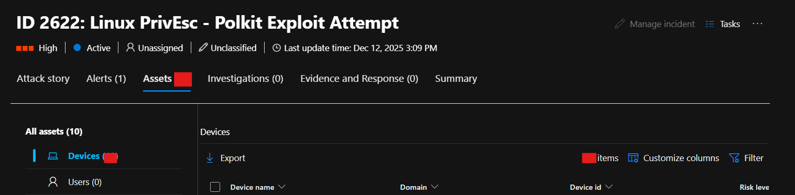
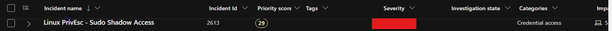
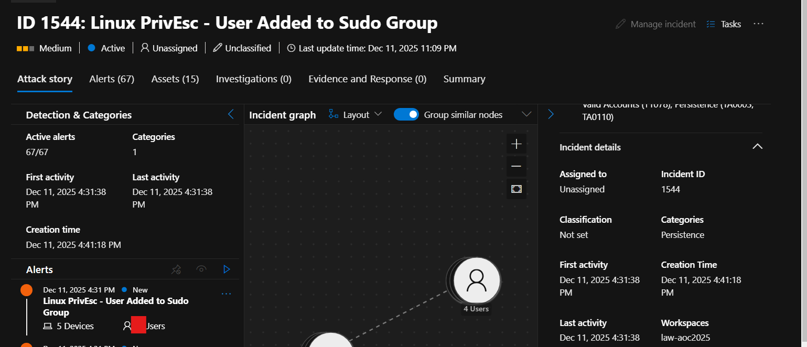
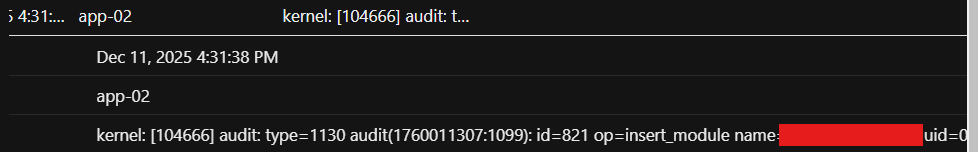
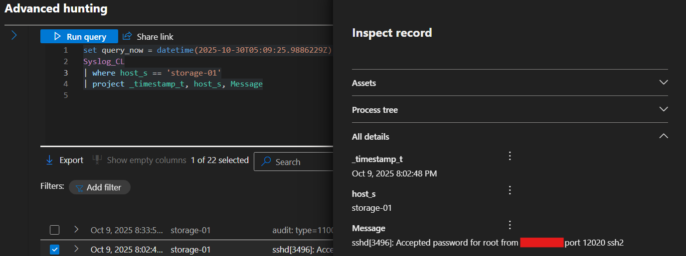
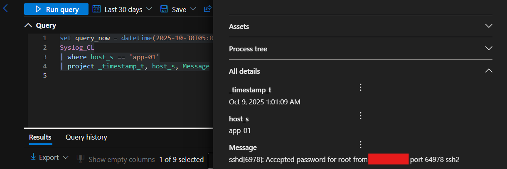
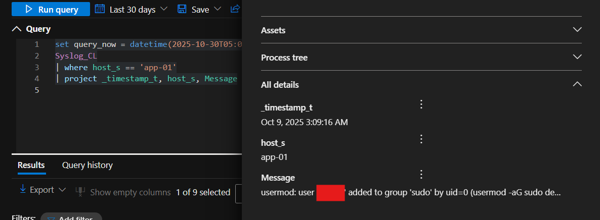

# Advent of Cyber 2025 Writeup: Day 10

## Overview
**Room URL:** https://tryhackme.com/room/azuresentinel-aoc2025-a7d3h9k0p2

### Objectives
1. To understand the importance of alert triaging and prioritization.
2. To explore Microsoft Sentinel and Microsoft Defender, its interface, alerts and incidents.

---

## Table of Contents
1. [Introduction](#introduction)   
2. [Walkthrough](#walkthrough)  
   - [Task 4: Investigation Proper](#task-4-investigation-proper)
   - [Task 5: Diving Deeper into Logs](#task-5-diving-deeper-into-logs)

---

## Introduction
This room introduces `Microsoft Sentinel` alongside `Microsoft Defender XDR` as a security tool to detect anomalies and support investigations. It deals with the importance of triaging alerts so that we're focused on minimizing damage to the organization and identifying correlated alerts to get a better picture of the attack.

There are four essential dimensions of triage
- **Severity:** How bad?
- **Time:** When?
- **Context:** Where in the attack lifecycle?
- **Impact:** Who or what is affected?

---

## Walkthrough

### Task 4: Investigation Proper

#### Sub-Question 1: How many entities are affected by the Linux PrivEsc - Polkit Exploit Attempt alert?
When looking at incidents, I sorted them by `Incident Name` and scrolled to the given incident. On investigating it, the answer is provided under the `Assets` tab.



#### Sub-Question 2: What is the severity of the Linux PrivEsc - Sudo Shadow Access alert?
When looking at incidents, I sorted them by `Incident Name` and scrolled to the given incident. The severity is mentioned under the `Severity` column.



#### Sub-Question 3: How many accounts were added to the sudoers group in the Linux PrivEsc - User Added to Sudo Group alert?
When looking at incidents, I sorted them by `Incident Name` and scrolled to the given incident. On investigating it, the required number of users is obtained.



### Task 5: Diving Deeper into Logs

#### Sub-Question 4: What is the name of the kernel module installed in websrv-01?
I modified the given query to be:
```
set query_now = datetime(2025-10-30T05:09:25.9886229Z);
Syslog_CL
| where host_s == 'websrv-01'
| project _timestamp_t, host_s, Message
```
This allowed me to look at logs for `websrv-01`. There I saw a log showing a module being installed using `insert_module_name` command.



#### Sub-Question 5: What is the unusual command executed within websrv-01 by the ops user?
Another log in `websrv-01` shows the unusual command executed by the `ops` user under the `COMMAND` parameter.


#### Sub-Question 6: What is the source IP address of the first successful SSH login to storage-01?
I modified the given query to be:
```
set query_now = datetime(2025-10-30T05:09:25.9886229Z);
Syslog_CL
| where host_s == 'storage-01'
| project _timestamp_t, host_s, Message
```
This allowed me to look at logs for `storage-01`. There I saw a log of Accepted password for root from a certain Source IP address. This is the required answer.



#### Sub-Question 7: What is the external source IP that successfully logged in as root to app-01?
I modified the given 
query to be:
```
set query_now = datetime(2025-10-30T05:09:25.9886229Z);
Syslog_CL
| where host_s == 'app-01'
| project _timestamp_t, host_s, Message
```
This allowed me to look at logs for `app-01`. There I saw a log of Accepted password for root from a certain Source IP address. This is the required answer.



#### Sub-Question 8: Aside from the backup user, what is the name of the user added to the sudoers group inside app-01?
In the same logs, I also saw a `usermod` command being run that added a specific user to the `sudoers` group inside app-01 which is the answer.



---