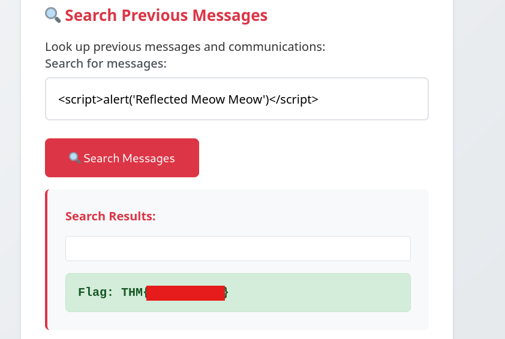
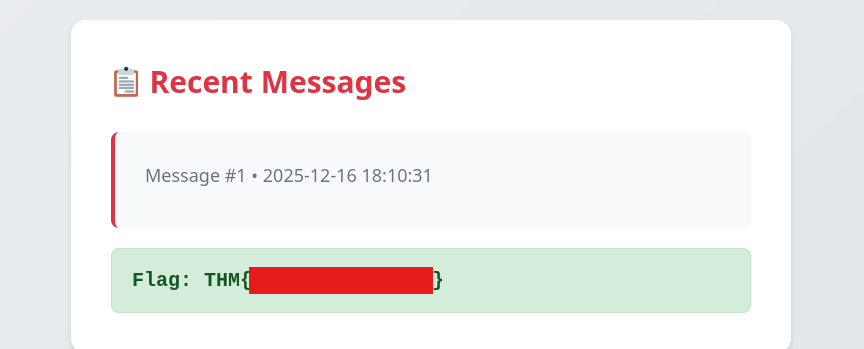

# Advent of Cyber 2025 Writeup: Day 11

## Overview
**Room URL:** https://tryhackme.com/room/xss-aoc2025-c5j8b1m4t6

### Objectives
1. To understand how XSS works and learn to prevent XSS attacks.

---

## Table of Contents
1. [Introduction](#introduction)   
2. [Walkthrough](#walkthrough)  
   - [Task: Leave the Cookies, Take the Payload](#task--leave-the-cookies-take-the-payload)

---

## Introduction
This room deals with Cross Site Scripting, a common way for attackers to influence web-based applications that take input from users. If these inputs are inserted without checks into a database query, the web application is vulnerable to XSS attacks.

XSS attacks that provide a response immediately after an injection are called Reflected XSS. When a malicious script is stored on the server and loaded for every other user visiting the web page, it is called a Stored XSS.

To protect against XSS there are three major practices:
1. Disable dangerous rendering paths. As an example, this means that instead of using `innerHTML` use `textContent` instead. This treats user input as text and parses it for HTML.

2. Make cookies inaccesible to JS by setting session cookies with the `HttpOnly`, `Secure` and `SameSite` attributes.

3. Sanitise input/output and encode special characters. 

---

## Walkthrough
### Task : Leave the Cookies, Take the Payload

#### Sub-Question 1:  Which type of XSS attack requires payloads to be persisted on the backend?
This answer is provided in the room's explanation itself.

#### Sub-Question 2: What's the reflected XSS flag?
On entering the malicious script into the message box and clicking `Search Messages` button, this flag becomes visible on the web page.

#### Sub-Question 3: What's the stored XSS flag?
On entering the malicious script into the message box and clicking `Send Message` button, this flag becomes visible on the web page.

---