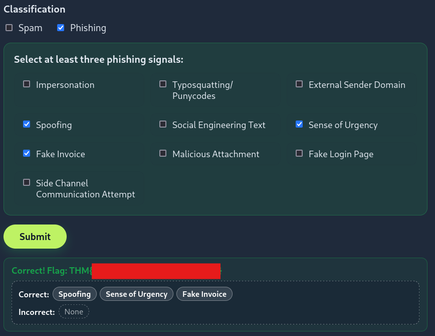
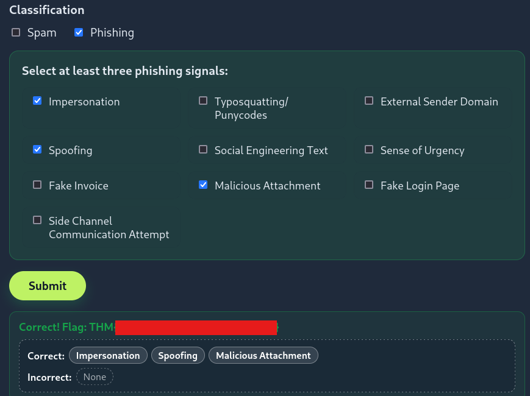
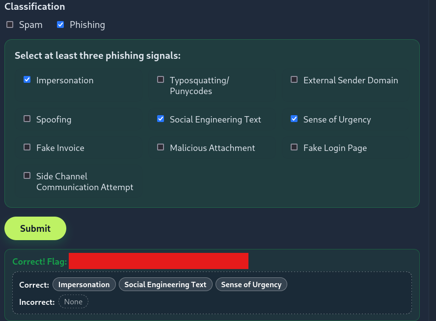
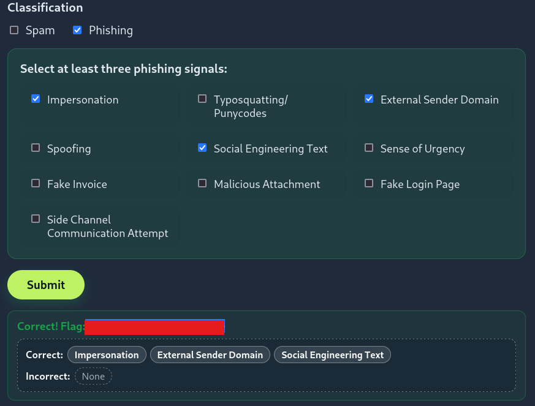
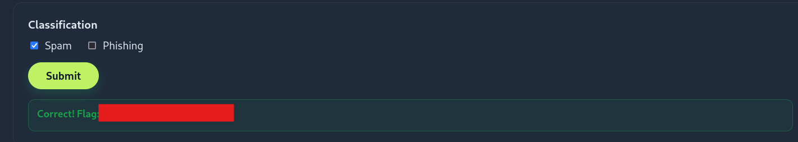
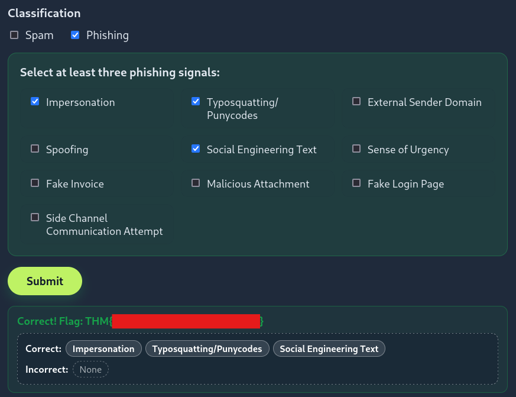

# Advent of Cyber 2025 Writeup: Day X

## Overview
**Room URL:** https://tryhackme.com/room/spottingphishing-aoc2025-r2g4f6s8l0

### Objectives
1. To understand things to look for when spotting phishing emails.
2. To learn trending phishing techniques.
3. To understand the difference between spam and phishing.

---

## Table of Contents
1. [Introduction](#introduction)   
2. [Walkthrough](#walkthrough)  
   - [Task: Spotting Phishing Emails](#task--spotting-phishing-emails)

---

## Introduction
This room deals with how to spot phishing emails and differentiate them from spam. The major difference is intent. Spam is designed to elicit user participation in something whereas phishing is designed to deceive and harm the potential victim.

There are a couple of elements associated with phishing emails and they are:
- Impersonation
- Spoofing
- Fake Invoices
- Side channel communication attempt
- Typosquatting/punycodes
- Social Engineering Text
- Malicious Attachment
- External Sender Domain
- Sense of Urgency
- Fake Login Page

---

## Walkthrough
### Task : Spotting Phishing Emails

#### Sub-Question 1: Classify the 1st email, what's the flag?
The first email appears to be an invoice from Paypal. The From header is legitimate and there are no embedded malicious links. However, the message appears to come from Santa Claus. Furthermore, the email fails SPF, DKIM and DMARC checks. This is suspicious, which is further highlighted by the fact that there is a suspicious return path.

Hence, I concluded that this is a Phishing email since this has elements of Spoofing, Fake Invoice and a sense of urgency to get the flag.

#### Sub-Question 2: Classify the 2nd email, what's the flag?
The second email appears to be a reminder that McSkidy has left a voicemail. The From header is fine and there are no suspicious links or text in the email body itself. However, a glaring point of suspicion is that the attachement masquerades as an audio file but is infact a webpage because it has a .html extension. Furthermore, it fails SPF and DKIM and provides a suspicious return-path for the email.

Hence, I concluded that this is a phishing email. It has elements of Impersonation, spoofing and a malicious attachment.

#### Sub-Question 3: Classify the 3rd email, what's the flag?
The third email is highly suspicious. Firstly, the sender's email address has gmail.com as domain address. Secondly, the email content is dripping with social engineering as it has elements of urgency. It also states that the person is unable to be contacted by verifiable means 

Hence, I concluded that this is a phishing email. It has a socially engineered text, tries to impersonate McSkidy and urges the receiver to complete an action.

#### Sub-Question 4: Classify the 4th email, what's the flag?
The fourth email comes from an external domain with an attractive proposal. This should already be raising alarms. Why would the HR of your company be reaching out to you using a dropbox email?

Hence, I concluded this to be a phishing email. It impersonates HR department, has an external sender domain and a socially engineered text.

#### Sub-Question 5: Classify the 5th email, what's the flag?
The fifth email is just Spam. This can be concluded because the sender is not impersonating anyone, rather they are just pitching a service to make TBFC's operations more efficient.

#### Sub-Question 6: Classify the 6th email, what's the flag?
The sixth and final email incorporates everything. It uses a punycode character in it's email domain impersonating TBFC's IT department. It presents an attractive lure in the form of a Christmas laptop upgrade using a legitimate tool, Microsoft Onedrive. In the link to open the message, it instead hides a redirect to a typosquatted domain looking similar to Microsoft's own domain. It also has a suspicious return path.

Hence, this is a phishing email. It incorporates Impersonation, Typosquatting and Punycodes, and Social Engineering text.

---