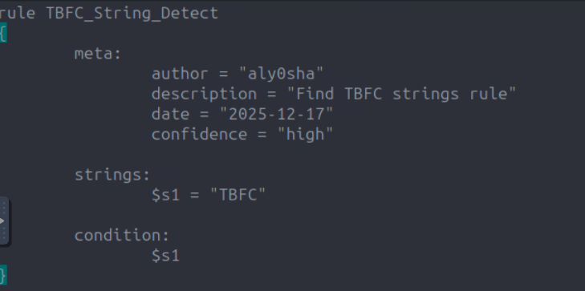
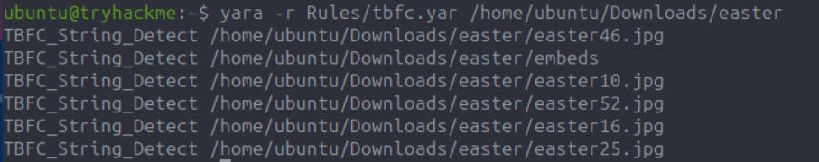
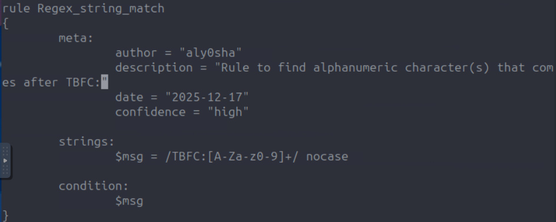
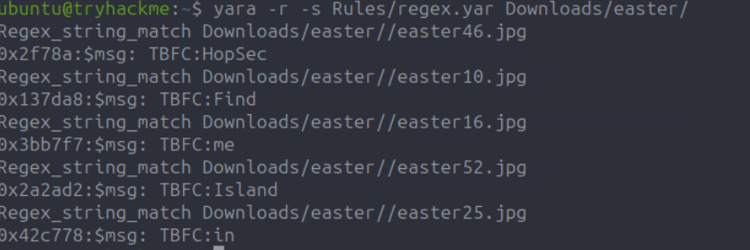

# Advent of Cyber 2025 Writeup: Day 13

## Overview
**Room URL:** https://tryhackme.com/room/yara-aoc2025-q9w1e3y5u7

### Objectives
1. To understand the basic concept of YARA and why it's used.
2. To explore the structure and types of YARA rules.
3. To write YARA rules and detect malicious indicators using it.
---

## Table of Contents
1. [Introduction](#introduction)   
2. [Walkthrough](#walkthrough)  
   - [Task: YARA rules](#task--yara-rules)

---

## Introduction
This room deals with YARA, a tool that is built to identify and classify malware by searching for unique patterns or digital fingerprints left behind by attackers. It scans codes, files and memory to match rules written by detection engineers.

Defenders rely on YARA for post-incident analysis, threat hunting, intelligence-based scans and memory analysis.

It is built of several elements out of which the following are most important:
- `meta`: Information about the rule itself
- `strings`: The clues YARA searches for such as text, byte sequences or regular expressions.
- `conditions`: The logic that decides when the rule triggers.

---

## Walkthrough
### Task : YARA rules

#### Sub-Question 1: How many images contain the string TBFC?
To answer this, I built a simple YARA rule to match instances of string `TBFC` being used. 

On running the YARA rule, I got a line of output for every match.

#### Sub-Question 2: What regex would you use to match a string that begins with TBFC: followed by one or more alphanumeric ASCII characters?
To answer this, I built a YARA rule to match instances of alphanumeric characters appearing after `TBFC:` string.

On running the YARA rule, I got to see the message fragments left behind by McSkidy.

#### Sub-Question 3: What is the message sent by McSkidy?
This is answered using the process followed in Sub-Question 2.

---