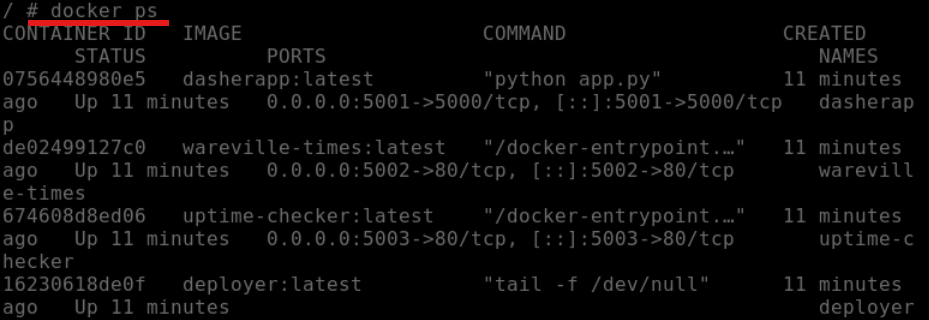
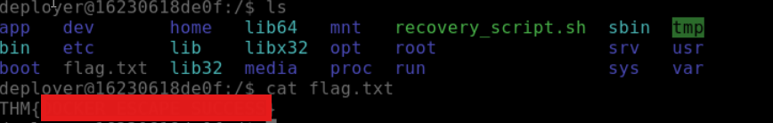

# Advent of Cyber 2025 Writeup: Day 14

## Overview
**Room URL:** https://tryhackme.com/room/container-security-aoc2025-z0x3v6n9m2

### Objectives
1. To learn how containers and Docker work
2. To understand Docker runtime concepts (sockets, daemon API)
3. To understand common container escape/privilege escalation vectors.

---

## Table of Contents
1. [Introduction](#introduction)   
2. [Walkthrough](#walkthrough)  
   - [Task: Container Security](#task--container-security)

---

## Introduction
This room gives an introduction to containers and reasons as to why they are a lightweight alternative to traditional Virtual machines. Containers allow us to scale parts of the application without having to scale the entire application itself. This provides access to a micro-service architecture.

---

## Walkthrough
### Task : Container Security

#### Sub-Question 1: What exact command lists running Docker containers?
This command is showcased in the room's walkthrough itself.

#### Sub-Question 2: What file is used to define the instructions for building a Docker image?
This file is mentioned in the room's walkthrough itself.

#### Sub-Question 3: What's the flag?
Once I logged into the `deployer` container, this flag was present as a text file in the `/` directory.

#### Sub-Question 4: Bonus Question: There is a secret code contained within the news site running on port 5002; this code also happens to be the password for the deployer user! They should definitely change their password. Can you find it?
On browsing to the endpoint running on port 5002, I was greeted by what looked like a news article. There were a few words that were in red. These, combined, is the password for the `deployer` user. 

---