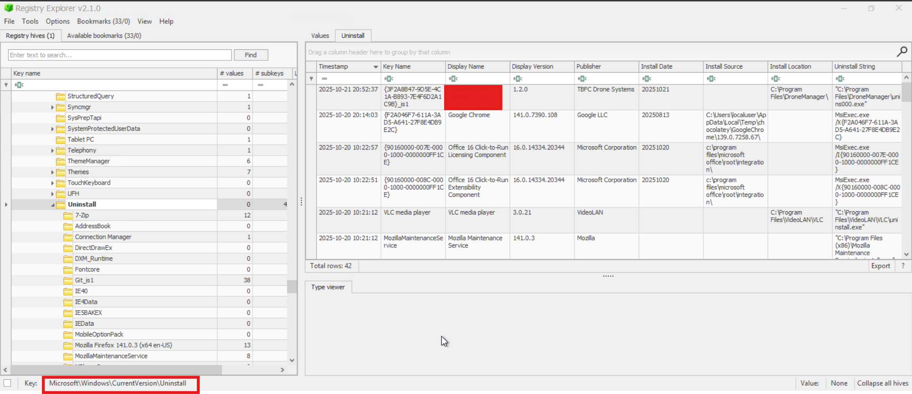
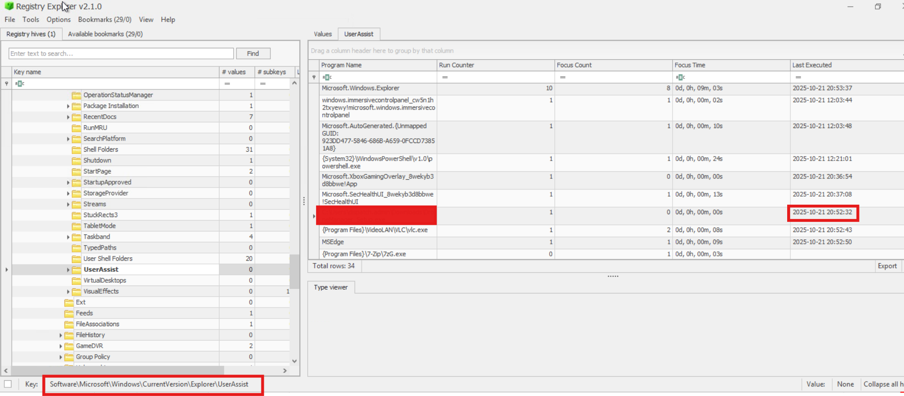
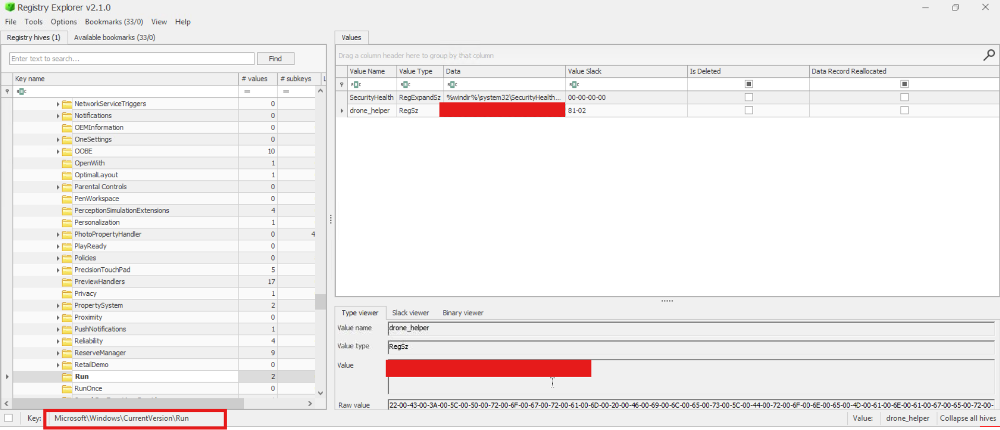

# Advent of Cyber 2025 Writeup: Day 16

## Overview
**Room URL:** https://tryhackme.com/room/registry-forensics-aoc2025-h6k9j2l5p8

### Objectives
1. To understand Windows Registry and Registry Hives.
2. To analyze Registry Hives through Registry Editor and Registry Explorer tools.

---

## Table of Contents
1. [Introduction](#introduction)   
2. [Walkthrough](#walkthrough)  
   - [Task: Investigate the Gifts Delivery Malfunctioning](#task--investigate-the-gifts-delivery-malfunctioning)

---

## Introduction
This room introduces Windows Registry Forensics. Windows Registry is the brain of Windows OS and contains all the information that it needs for its functioning. This **Brain** is split into multiple files and stored at different places within the computer.

The following is a table of some of the important things these hives contain:
| Hive Name      | Contains                                                                 | Location                                                     |
|----------------|--------------------------------------------------------------------------|--------------------------------------------------------------|
| SYSTEM         | Services, Mounted Devices, Boot Configuration, Drivers, Hardware | C:\Windows\System32\config\SYSTEM                            |
| SECURITY       | Local Security Policies, Audit Policy Settings                          | C:\Windows\System32\config\SECURITY                          |
| SOFTWARE       | Installed Programs, OS Version and other info, Autostarts, Program Settings | C:\Windows\System32\config\SOFTWARE                          |
| SAM            | Usernames and their Metadata, Password Hashes, Group Memberships, Account Statuses | C:\Windows\System32\config\SAM                               |
| NTUSER.DAT     | Recent Files, User Preferences, User-specific Autostarts              | C:\Users\username\NTUSER.DAT                                 |
| USRCLASS.DAT   | Shellbags, Jump Lists                                                    | C:\Users\username\AppData\Local\Microsoft\Windows\           |

Some important registry keys to consider during an investigation are: 

| Registry Key | Importance |
|-------------|------------|
| HKCU\Software\Microsoft\Windows\CurrentVersion\Explorer\UserAssist | It stores information on recently accessed applications launched via the GUI. |
| HKCU\Software\Microsoft\Windows\CurrentVersion\Explorer\TypedPaths | It stores all the paths and locations typed by the user inside the Explorer address bar. |
| HKLM\Software\Microsoft\Windows\CurrentVersion\App Paths | It stores the path of the applications. |
| HKCU\Software\Microsoft\Windows\CurrentVersion\Explorer\WordWheelQuery | It stores all the search terms typed by the user in the Explorer search bar. |
| HKLM\Software\Microsoft\Windows\CurrentVersion\Run | It stores information on the programs that are set to automatically start (startup programs) when the user logs in. |
| HKCU\Software\Microsoft\Windows\CurrentVersion\Explorer\RecentDocs | It stores information on the files that the user has recently accessed. |
| HKLM\SYSTEM\CurrentControlSet\Control\ComputerName\ComputerName | It stores the computer's name (hostname). |
| HKLM\SOFTWARE\Microsoft\Windows\CurrentVersion\Uninstall | It stores information on the installed programs. |

---

## Walkthrough
### Task : Investigate the Gifts Delivery Malfunctioning

#### Sub-Question 1: What application was installed on the dispatch-srv01 before the abnormal activity started?
To find this answer, I referred to the table above. From that I knew I had to import the `SOFTWARE` registry hive because the `Uninstall` key located within it would give me information on installed programs. On doing so in `Registry Explorer`, I found a suspicious program that was installed on October 21st.

#### Sub-Question 2: What is the full path where the user launched the application (found in question 1) from?
To find this answer, I referred to the table above. From that I knew I had to import the `USRCLASS.DAT` registry hive because the `UserAssist` key located within it would give me information on recently launched programs. On doing so in `Registry Explorer`, I found the path where the suspicious program was launched from.

#### Sub-Question 3: Which value was added by the application to maintain persistence on startup?
To find this answer, I went back to the `SOFTWARE` registry hive because the `Run` key located within it would give me information on persistence activities. There was only one non-system file which is the answer.

---