# Advent of Cyber 2025 Writeup: Day 17

## Overview
**Room URL:** https://tryhackme.com/room/encoding-decoding-aoc2025-s1a4z7x0c3

### Objectives
1. To understand base64 encoding and decoding.
2. To learn how to use cyberchef
3. To learn how to identify useful information in web applications through HTTP headers.

---

## Table of Contents
1. [Introduction](#introduction)   
2. [Walkthrough](#walkthrough)  
   - [Task 3: First Lock - Outer Gate](#task-3-first-lock---outer-gate)
   - [Task 4: Second Lock - Outer Wall](#task-4-second-lock---outer-wall)
   - [Task 5: Third Lock - Guard House](#task-5-third-lock---guard-house)
   - [Task 6: Fourth Lock - Inner Castle](#task-6-fourth-lock---inner-castle)
   - [Task 7: Fifth Lock - Prison Tower](#task-7-fifth-lock---prison-tower)

---

## Introduction
This room presents a gamified environment where I have to use various forms of encoding and decoding to gain access to deeper levels. Firstly, it talks about the difference between Encoding and Encryption. Encoding is done for compatibility through a standardized process whereas Encryption is done for confidentiality of data using an encryption algorithm paired with some key(s).

CyberChef is an online/offline tool that can help decode multiple layers of encoded data.

---

## Walkthrough
### Task 3: First Lock - Outer Gate 
The task involves providing username and password credentials to the login form. As instructed, the `Username` field will take the `Base64` encoded format of the Guard's name. Since the guard's name is `CottonTail`, I used Linux's `base64` tool to find the encoded name.
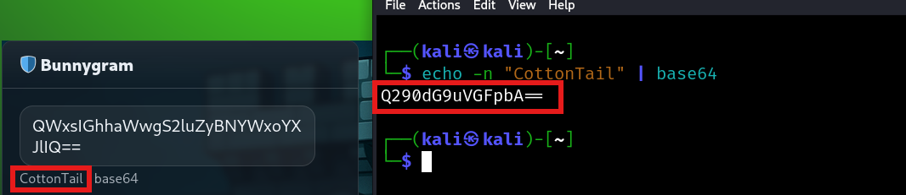
Browsing to the `Network` tab of the Developer tools, I saw the magic question. According to the instructions, I converted the question into `Base64` format and asked it to the guard who gave an answer back.
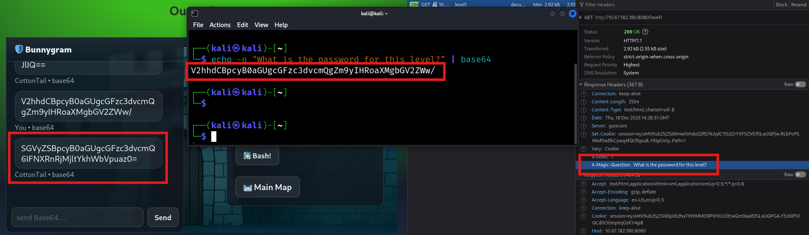
This was decoded to reveal the answer.

### Task 4: Second Lock - Outer Wall 
The task involves providing username and password credentials to the login form. As instructed, the `Username` field will take the `Base64` encoded format of the Guard's name. Since the guard's name is `CarrotHelm`, I used Linux's `base64` tool to find the encoded name.
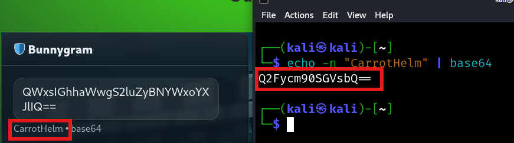
Browsing to the `Network` tab of the Developer tools, I saw the magic question. According to the instructions, I converted the question into `Base64` format and asked it to the guard who gave an answer back.
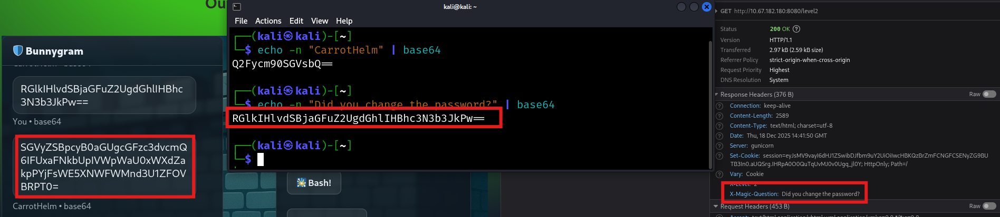
The `Debugger` tab shows that the supplied password is encoded to `Base64` two times, so to find the answer, I have to decode it twice to get the answer.
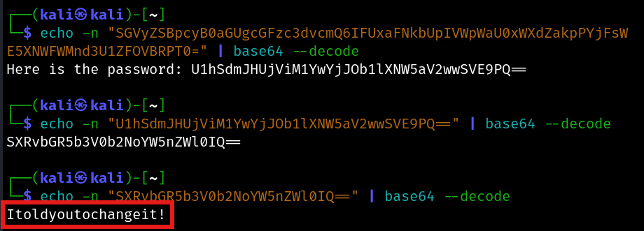

### Task 5: Third Lock - Guard House
The task involves providing username and password credentials to the login form. As instructed, the `Username` field will take the `Base64` encoded format of the Guard's name. Since the guard's name is `LongEars`, I used Linux's `base64` tool to find the encoded name.
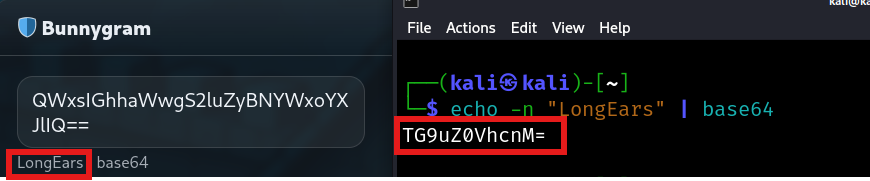
As instructed, I asked the Guard for the password in `base64` who sent it without hesitation.
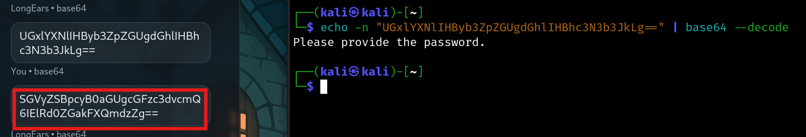
On `base64` decoding it, I got an encoded password as the output. Checking the `Debugger` tab, I found out that this password is encoded using the structure `XOR(key: cyberchef) => b64-encode`, so to decode it, I followed the structure `b64-decode => XOR(key: cyberchef)`
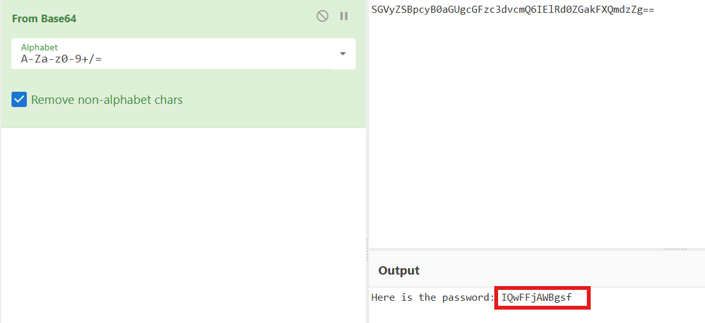

### Task 6: Fourth Lock - Inner Castle
The task involves providing username and password credentials to the login form. As instructed, the `Username` field will take the `Base64` encoded format of the Guard's name. Since the guard's name is `Lenny`, I used Linux's `base64` tool to find the encoded name.
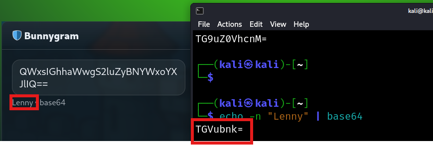
As instructed, I asked the Guard for the password in `base64` who sent it without hesitation.

On checking the `Debugger` tab, I saw that the password is hashed. The password returned by the guard is in `MD5` format so I used `john` along with the `rockyou` wordlist to crack the hash.
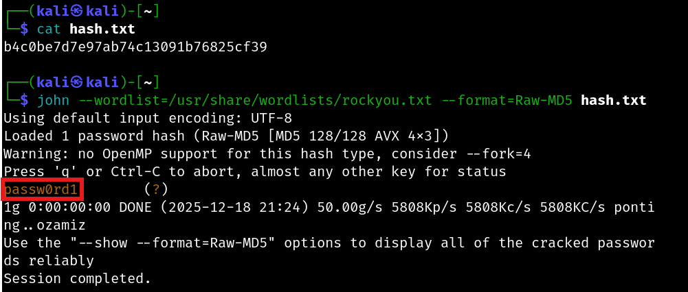

### Task 7: Fifth Lock - Prison Tower 
The task involves providing username and password credentials to the login form. As instructed, the `Username` field will take the `Base64` encoded format of the Guard's name. Since the guard's name is `Carl`, I used Linux's `base64` tool to find the encoded name. As instructed, I asked the Guard for the password in `base64` who sent it without hesitation.
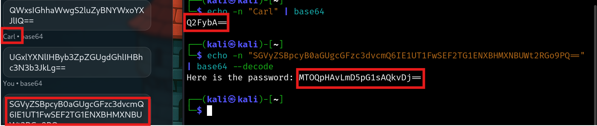
On checking the `Network` tab, I saw the Recipe ID and Key which will be useful in decoding the password.
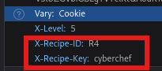
On checking the `Debugger` tab, I saw the algorithm used to encode the password. The encoding follows the format `ROT13 => b64-encode => ROT47`. So to decode it, I did the reverse: `ROT47 => b64-decode => ROT13`. This gave me the final password.
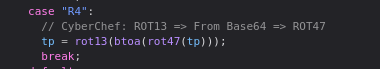
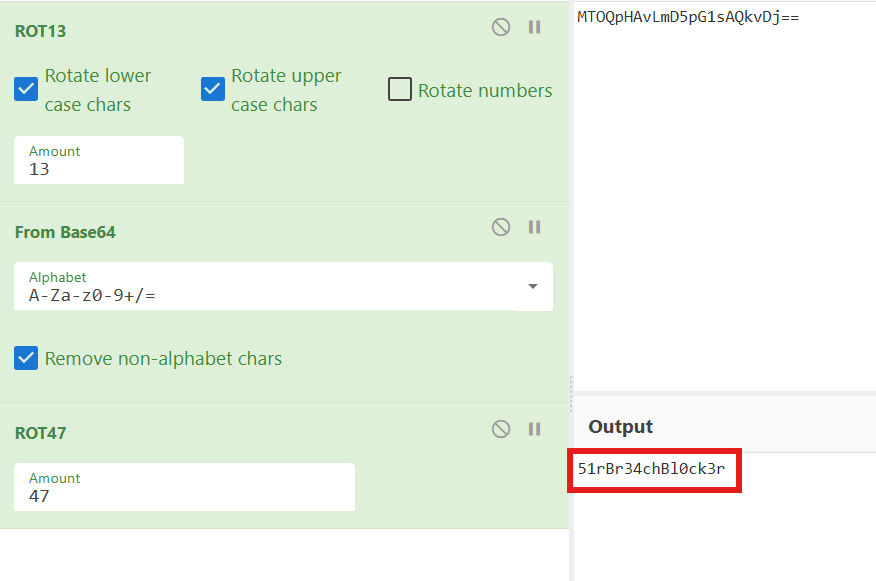
On successfully unlocking all the locks, I also got the final flag.

---