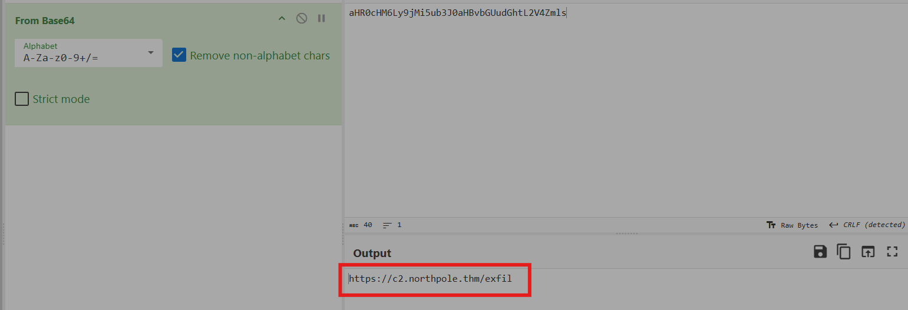
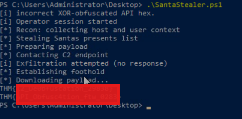
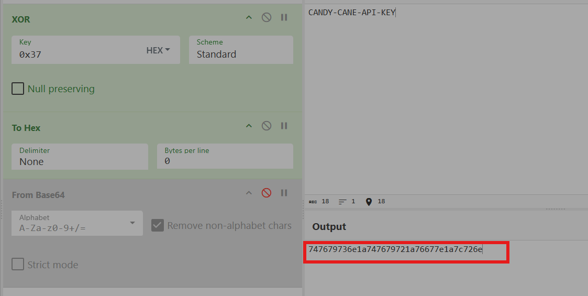

# Advent of Cyber 2025 Writeup: Day 18

## Overview
**Room URL:** https://tryhackme.com/room/obfuscation-aoc2025-e5r8t2y6u9

### Objectives
1. To learn about obfuscation and its purpose
2. To understand the difference between encoding, encryption and obfuscation.
---

## Table of Contents
1. [Introduction](#introduction)   
2. [Walkthrough](#walkthrough)  
   - [Task: Obfuscation and Deobfuscation](#task--obfuscation-and-deobfuscation)

---

## Introduction
This room deals with obfuscation and how to deobfuscate them to get meaning out of seemingly mangled strings. The major difference between encoding, encryption and obfuscation is that, encoding is for data representation and compatibility, encryption is for security and confidentiality and obfuscation is for discouraging understanding or reverse engineering.

Some times, threat actors can use multi-layer obfuscation that is the output of one obfuscation layer is fed into another obfuscation layer as input. This further discourages and hides the true meaning.

---

## Walkthrough
### Task : Obfuscation and Deobfuscation

#### Sub-Question 1: What is the first flag you get after deobfuscating the C2 URL and running the script?
The C2 URL is Base64 encoded hence, using cyberchef, it can easily be decoded to reveal the URL. This URL can be added in the `.ps1` script to reveal the flag.

#### Sub-Question 2: What is the second flag you get after obfuscating the API key and running the script again?
The API key can be `XOR`ed with key `0x37` followed by conversion to Hexadeciaml. This can be added to the `.ps1` script to reveal the flag.

---