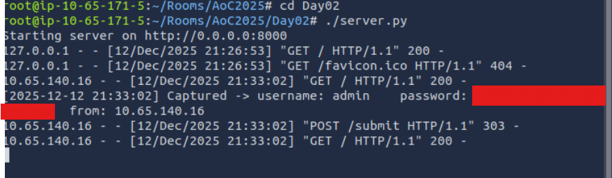
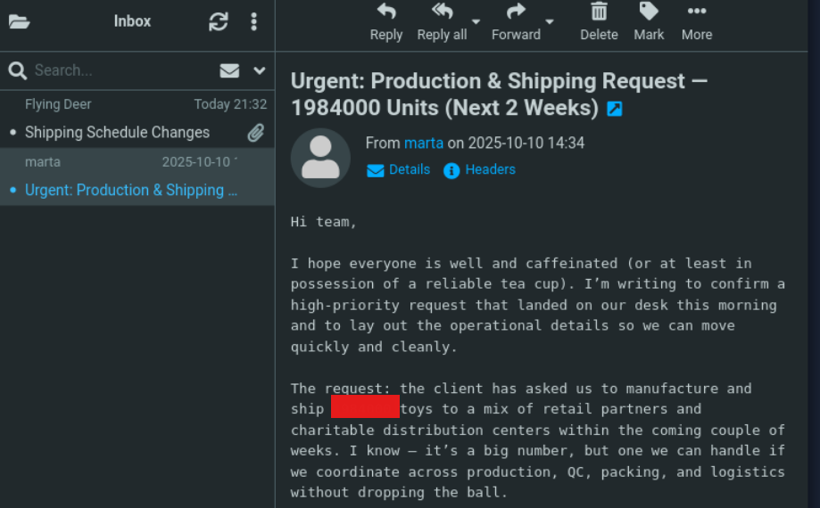

# Advent of Cyber 2025 Writeup: Day 2

## Overview
**Room URL:** https://tryhackme.com/room/phishing-aoc2025-h2tkye9fzU

### Objectives

---

## Table of Contents
1. [Introduction](#introduction)   
2. [Walkthrough](#walkthrough)  
   - [Task: Phishing Exercise for TBFC](#task-phishing-exercise-for-tbfc)
3. [Lessons Learned](#lessons-learned)

---

## Introduction
This room involves a hands on approach to phishing simulations. In this room, I was asked to perform a phishing attack using the `Social Engineer Toolkit (SET)` in order to capture credentials of the victim using a self-hosted server. Furthermore, this room provided the `STOP` mnemonic which can be interpreted in two ways:
- _Is it a phishing attack?_: **S**uspicious? **T**elling me to click something? **O**ffering me an amazing deal? **P**ushing me to do something now.

- _What to do if it is?_: **S**low down. **T**ype the address yourself. **O**pen nothing unexpected. **P**rove the sender.
---

## Walkthrough
### Task: Phishing Exercise for TBFC

#### Sub-Question 1: What is the password used to access the TBFC portal? 
The password used to access the portal is captured by the credential harvester we deployed. It is visible in the web server logs.

#### Sub-Question 2: Browse to `http://MACHINE_IP` from within the AttackBox and try to access the mailbox of the `factory` user to see if the previously harvested `admin` password has been reused on the email portal. What is the total number of toys expected for delivery?
 
This question highlights an important yet unfortunate facts. Passwords are reused across accounts. This sadly leads to a chain of compromises provided that one account is breached. In this case, both `factory` and `admin` users have same passwords. This allows us to gain access to the `factory` account's email address and see its mailbox. 

---

## Lessons Learned
1. Usage of the `Social-Engineer Toolkit` to deliver phishing email.
2. Impact of reused credentials leading to massive breaches.

---