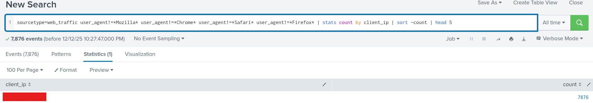
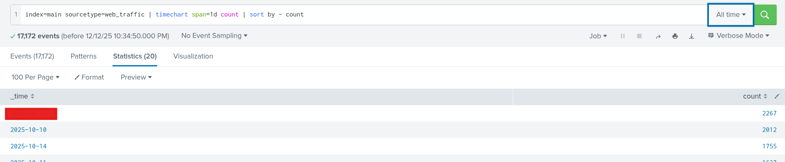
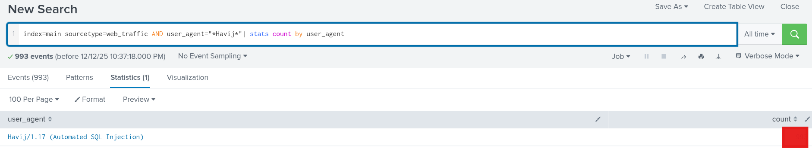
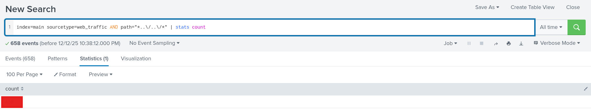
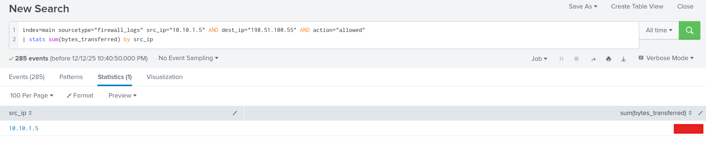

# Advent of Cyber 2025 Writeup: Day 3

## Overview
**Room URL:** https://tryhackme.com/room/splunkforloganalysis-aoc2025-x8fj2k4rqp 

### Objectives
1. To understand SPL Query Language.
2. To understand how to investigate the different stages of an incident lifecycle.
---

## Table of Contents
1. [Introduction](#introduction)   
2. [Walkthrough](#walkthrough)  
   - [Task: Log Analysis with Splunk](#task-log-analysis-with-splunk)
3. [Lessons Learned](#lessons-learned)  
4. [References](#references)

---

## Introduction
This room is focused on investigating the different stages of an incident using Splunk. In the process, it teaches about the syntax of the SPL language and how to use the Splunk interface to hunt for anomalies.

---

## Walkthrough
### Task: Log Analysis with Splunk

#### Sub-Question 1: What is the attacker IP found attacking and compromising the web server?

A suspicious IP can immediately be identified just from the simple query `index=main sourcetype="web_traffic"`. Although there are 100+ `client_ip`, one of them is responsible for almost half of the logs.

Just to be sure we can filter out `client_ip`s for user agents that are representative of typical browsers. We can do this using: `sourcetype=web_traffic user_agent!=*Mozilla* user_agent!=*Chrome* user_agent!=*Safari* user_agent!=*Firefox* | stats count by client_ip | sort -count | head 5`

This gives us just one IP address which is the IP address attacking our server.

#### Sub-Question 2: Which day was the peak traffic in the logs? (Format: YYYY-MM-DD)

To look at peak traffic in the logs we'll simply use the query `index=main sourcetype=web_traffic | timechart span=1d count | sort by - count`.

#### Sub-Question 3: What is the count of Havij user_agent events found in the logs?

We can use the query `index=main sourcetype=web_traffic AND user_agent="*Havij*"| stats count by user_agent`

 

#### Sub-Question 4: How many path traversal attempts to access sensitive files on the server were observed?

We can use the query `index=main sourcetype=web_traffic AND path="*..\/..\/*" | stats count`

#### Sub-Question 5: Examine the firewall logs. How many bytes were transferred to the C2 server IP from the compromised web server?

We can use the query `index=main sourcetype="firewall_logs" src_ip="10.10.1.5" AND dest_ip="198.51.100.55" AND action="allowed" | stats sum(bytes_transferred) by src_ip`

---

## Lessons Learned

Splunk can be used to trace an attack from Recon all the way to Data exfiltration. The following queries could be used for the different stages of an attack.

1. Reconnaissance: `sourcetype=web_traffic client_ip="<REDACTED>" AND path IN ("/.env", "/*phpinfo*", "/.git*") | table _time, path, user_agent, status`

2. Enumeration: `sourcetype=web_traffic client_ip="<REDACTED>" AND path="*..\/..\/*" OR path="*redirect*" | stats count by path`

3. Exfiltration: `sourcetype=web_traffic client_ip="<REDACTED>" AND path IN ("*backup.zip*", "*logs.tar.gz*") | table _time path, user_agent`

4. Remote Code Execution and ransomware: `sourcetype=web_traffic client_ip="<REDACTED>" AND path IN ("*bunnylock.bin*", "*shell.php?cmd=*") | table _time, path, user_agent, status`
