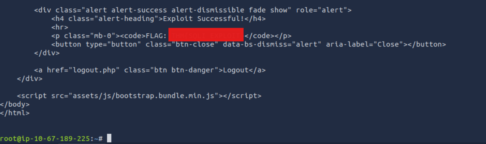

# Advent of Cyber 2025 Writeup: Day 4

## Overview
**Room URL:** https://tryhackme.com/room/AIforcyber-aoc2025-y9wWQ1zRgB

### Objectives
1. To understand how AI can be an efficient partner for cybersecurity roles.
2. To understand the role of AI in solving defensive, offensive as well as software development roles 

---

## Table of Contents
1. [Introduction](#introduction)   
2. [Walkthrough](#walkthrough)  
   - [Task: AI for Cybersecurity Showcase](#task-ai-for-cybersecurity-showcase)

---

## Introduction
This room deals with the use of AI in solving cybersecurity problems and automating menial or tedious tasks. It walks us through usecases of AI in Red Team, Blue Team and Software tasks.

---

## Walkthrough
### Task: AI for Cybersecurity Showcase

#### Sub-Question 1: Complete the AI showcase by progressing through all of the stages. What is the flag presented to you?

I forgot to take the screenshot here. But complete all the four stages and you'll get the answer in `THM{}` format.

#### Sub-Question 2: Execute the exploit provided by the red team agent against the vulnerable web application hosted at 10.67.186.191:5000. What flag is provided in the script's output after it?
This task just involves waiting for the Red Team Stage to be completed. Once the chatbot generates the script, I copy pasted it to the attack box and changed the `MACHINE_IP` to my victim machine's IP. After that, running the script with `Python` gives the flag in the terminal.

---

