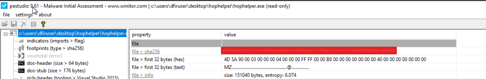
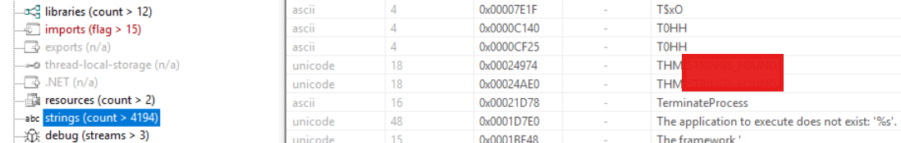
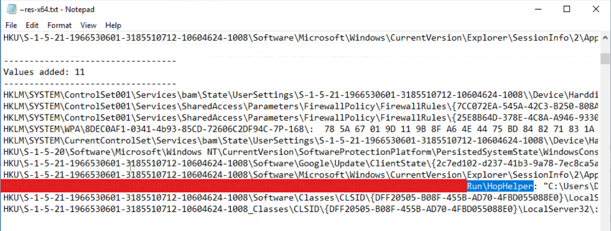
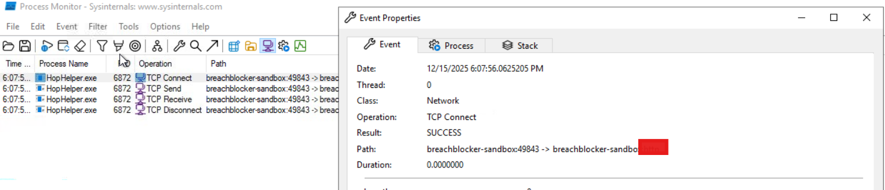
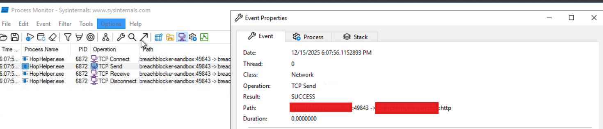

# Advent of Cyber 2025 Writeup: Day 6

## Overview
**Room URL:** https://tryhackme.com/room/malware-sandbox-aoc2025-SD1zn4fZQt

### Objectives
1. To learn how malware is analyzed statically and dynamincally.
2. To use common tools associated with malware analysis.

---

## Table of Contents
1. [Introduction](#introduction)   
2. [Walkthrough](#walkthrough)  
   - [Task: Malware Analysis using Sandboxes](#task--malware-analysis-using-sandboxes)

---

## Introduction
This room deals with malware analysis both static and dynamic. It gives an insight into how a potential malware can be statically analyzed using tools like `PEStudio`. It also details the execution of malware in sandboxes to identify how it actually works using tools like `Regshot` and `Procmon`.

---

## Walkthrough
### Task : Malware Analysis using Sandboxes

#### Sub-Question 1: What is the SHA256Sum of the HopHelper.exe?
This is visible in the main page of `PEStudio` under `file > sha256`.

#### Sub-Question 2: Within the strings of HopHelper.exe, a flag with the format THM{XXXXX} exists. What is that flag value?
This can be found in the `strings` tab. Once the file had been analyzed, I sorted the strings alphabetically to find the flag.

#### Sub-Question 3: What registry value has the HopHelper.exe modified for persistence?
Registry value linked with persistence is the `Run` key. Searching for that value in the comparision between Registry snapshots generated by `Regshot`, the answer was found.

#### Sub-Question 4: Filter the output of ProcMon for "TCP" operations. What network protocol is HopHelper.exe using to communicate?
I started `ProcMon` and began capturing events before launching the malicious executable. Once it was executed, I filtered for Network operations from the `HopHelper.exe` process. On inspecting the property of one of the TCP operation, the protocol was identified.

#### Sub-Question 5: Can you find the web panel that HopHelper.exe is communicating with?
This can also be found using the same method as above.

---