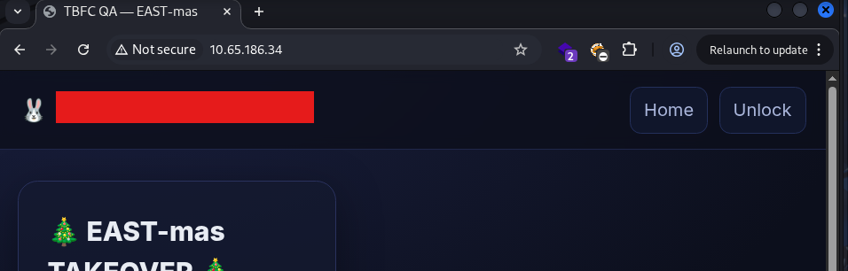
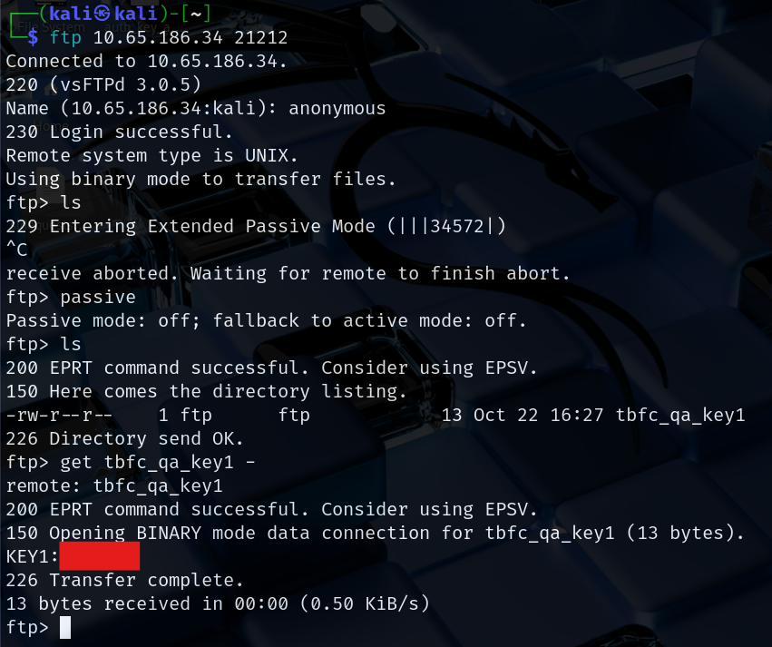
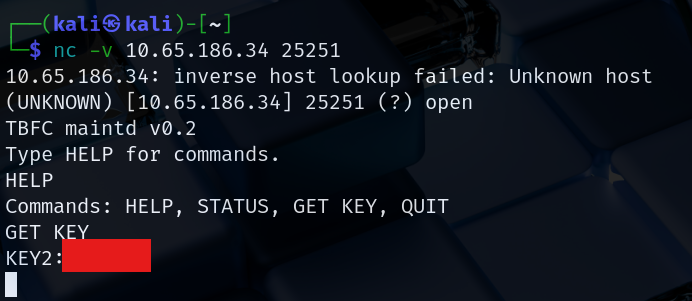
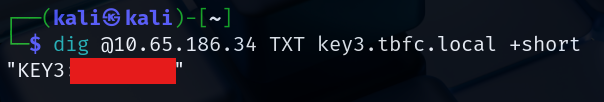
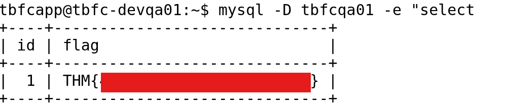

# Advent of Cyber 2025 Writeup: Day 7

## Overview
**Room URL:** https://tryhackme.com/room/networkservices-aoc2025-jnsoqbxgky

### Objectives
1. To learn the basics of network mapping with `nmap`.
2. To understand the use of `netcat` when interfacing with network protocols.
3. To identify common ports associated with services.

---

## Table of Contents
1. [Introduction](#introduction)   
2. [Walkthrough](#walkthrough)  
   - [Task: Discover Network Services](#task--discover-network-services)

---

## Introduction
This room deals with using a network mapper to identify and exploit open ports in a server. The goal here is to identify an exposed service and use that as foothold to gain access into the system for further compromise.

---

## Walkthrough
### Task : Discover Network Services

#### Sub-Question 1: What evil message do you see on top of the website?
This answer can be found by simply visiting the `HTTP` page being served by the machine.

#### Sub-Question 2: What is the first key part found on the FTP server?
For this part, I logged into the exposed `ftp` server running on an uncommon port using `anonymous` login. After that, to prevent the server from stalling, I disabled `passive` mode. After that, simply using the `get` command revealed the answer.  

#### Sub-Question 3: What is the second key part found in the TBFC app?
For this part, I tried to exploit another service running on a non-standard port. I used `netcat` for this which revealed the answer.

#### Sub-Question 4: What is the third key part found in the DNS records?
For this part, I queried a DNS server located at a certain IP. The answer was provided in the DNS server's response.

#### Sub-Question 5: Which port was the MySQL database running on?
MySQL typically runs on a standard port number.

#### Sub-Question 6: Finally, what's the flag you found in the database?
Running the commands in the room itself showed the tables in the database. Viewing the entries in the `flag` table is how I found the answer.

---