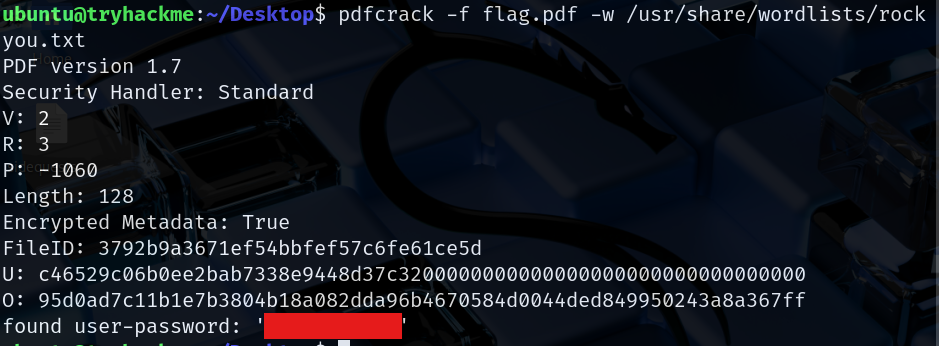
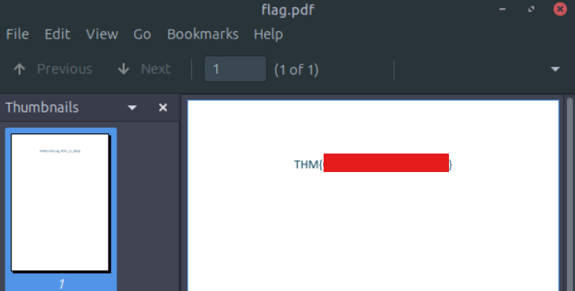
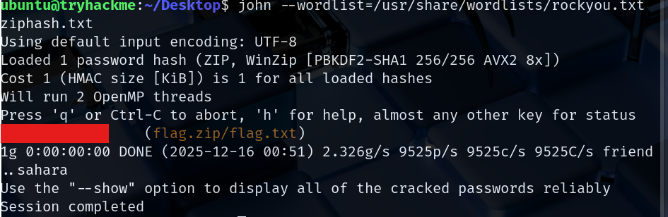
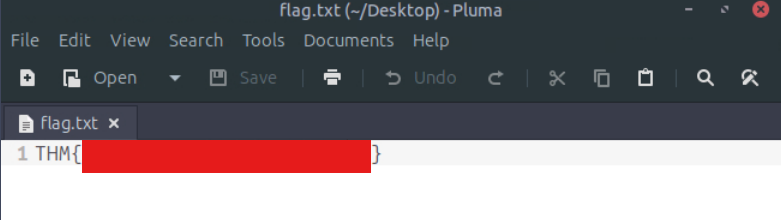

# Advent of Cyber 2025 Writeup: Day 9

## Overview
**Room URL:** https://tryhackme.com/room/attacks-on-ecrypted-files-aoc2025-asdfghj123

### Objectives
1. To understand the working mechanism of password-based encryption.
2. To understand the consequences of using weak or compromised passwords.
3. To exploit/crack the password of an encrypted file to reveal its contents.

---

## Table of Contents
1. [Introduction](#introduction)   
2. [Walkthrough](#walkthrough)  
   - [Task: Attacks against encrypted files](#task--attacks-against-encrypted-files)

---

## Introduction
This room deals with password cracking using tools like `hydra` and `john` alongside specialized tools like `pdfcrack`. These tools use wordlists of common passwords (such as the `rockyou.txt`) file, optionally supported by a GPU to crack passwords in common file formats.

---

## Walkthrough
### Task : Attacks against Encrypted Files

#### Sub-Question 1: What is the flag inside the encrypted PDF?
This flag can be obtained by using `pdfcrack` tool alongside `rockyou.txt` file. Once the password has been cracked, we can simply open the PDF file and enter the password to view the flag.

#### Sub-Question 2: What is the flag inside the encrypted zip file?
This flag can be obtained using `john` tool. First the zip file has to be converted into a file that `john` understands. I did this using `zip2hash`. Then `john` was used to crack it and obtain the password. This password was used to extract the file inside the `zip` file and on opening it, I got the flag. 

---