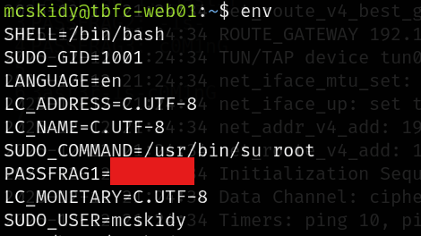
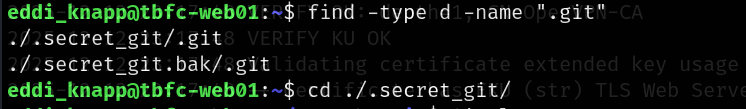
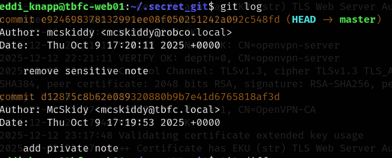
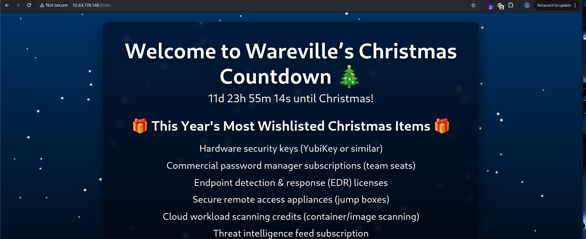
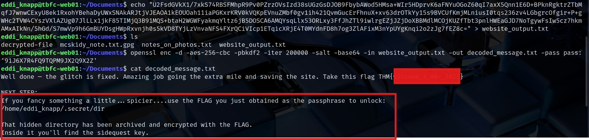

# Advent of Cyber 2025 Writeup: Pre-Side-Quest-1

## Overview
**Room URL:** https://tryhackme.com/room/linuxcli-aoc2025-o1fpqkvxti

## Table of Contents
1. [Introduction](#introduction)   
2. [Walkthrough](#walkthrough)  
   - [Hunting for password fragments](#hunting-for-password-fragments)
   - [Decrypting McSkidy's message number 1](#decrypting-mcskidys-message-number-1)
   - [Fixing the website](#fixing-the-website)
   - [Decrypting McSkidy's message number 2](#decrypting-mcskidys-message-number-2)
3. [Lessons Learned](#lessons-learned)

---

## Introduction
This is the task for getting the key for the first side quest that is accessed through `/home/mcskidy/Documents` in Day 1 of Advent of Cyber 2025.

---

## Walkthrough
This quest starts with accessing the `read-me-please.txt` located in the `/home/mcskidy/Documents/` of `tbfc-web01` server. Reading the contents of the file gives us credentials for a user `eddi_knapp` along with hints for three password fragments.

We are then directed to join these fragments and use them to decrypt a message in the server. 

### Hunting for password fragments

First, we have to switch to the `eddi_knapp` user using the credentails provided. Then only we can carry out other tasks.

The clue for the first fragment is:
> _I ride with your session, not with your chest of files. Open the little bag your shell carries when you arrive._

This means that the first password is associated with our session and not with our storage. Since this also refers to our shell, it definitely means **Environment variables**. So using the `env` command, we can list our environment variables, along with the first password fragment.

The clue for the second fragment is:
> _The tree shows today; the rings remember yesterday. Read the ledger’s older pages._

This refers to `Git`, with reference to trees and ledgers. So I switched to the `home` directory for `eddi_knapp` and searched for `.git` folders.

Going to the `.secret_git` folder and checking logs, I found that a private note was added and then removed.

Using `git diff` command along with the commit hashes allowed me to find the second fragment.

The clue for the third fragment is:
> _When pixels sleep, their tails sometimes whisper plain words. Listen to the tail._

Reference to pixels might mean pictures and plain words might refer to words hidden in pictures. So, I checked the Pictures directory to find a hidden file.

Using strings command on this file revealed the final fragment.

#### Decrypting McSkidy's message number 1

The `read-me-please.txt` asked us to join the message and use it to decrypt the message left by McSkiddy on the system. My first guess was inspecting the `Documents` folder. There, I found a `.gpg` file left by her. I used the passphrase to decrypt the file and store the contents into a new file called `decrypted-file`. 

Viewing the contents of this file provides a solution to fix the glitch on the website along with further instructions.

#### Fixing the website

The `decrypted-file` asks us to modify the `/home/socmas/2025/wishlist.txt` file in order to stop the glitching. I used `nano` to do this and the glitch was subsequently stopped. 

On inspecting the website, there is a ciphertext present in the website as mentioned by the message left by McSkiddy.

This message was decrypted using the command in the message itself to reveal another hidden message along with a flag.

#### Decrypting McSkidy's message number 2

On visiting the location provided by the message, I found a `dir.tar.gz.gpg` file. I used the flag obtained in the previous step to decode the file to get `dir.tar.gz`. I then used the `tar` command to decrypt the `.tar.gz` file to finally obtain `sq1.png` inside the `dir` folder.

Opening the `sq1.png` gave me nothing so I just transferred it to my host machine using `scp` command.

On opening the image in my host computer, using the `open` command, I found the final key

---

## Lessons Learned

- Learned about Environment vairables.
- Learned about Git and commit logs.
- Learned about hidden files and directories.
- Learned about decrypting gpg files and decompressing gz files.
- Learned about image steganography.
